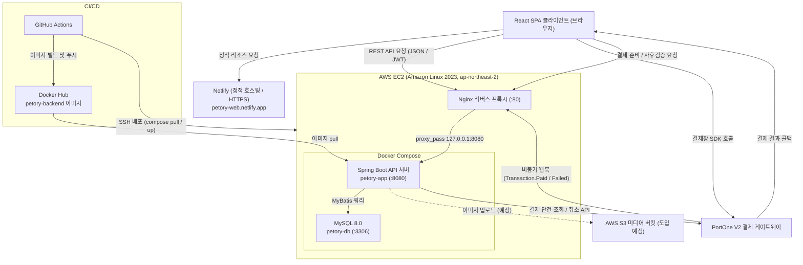
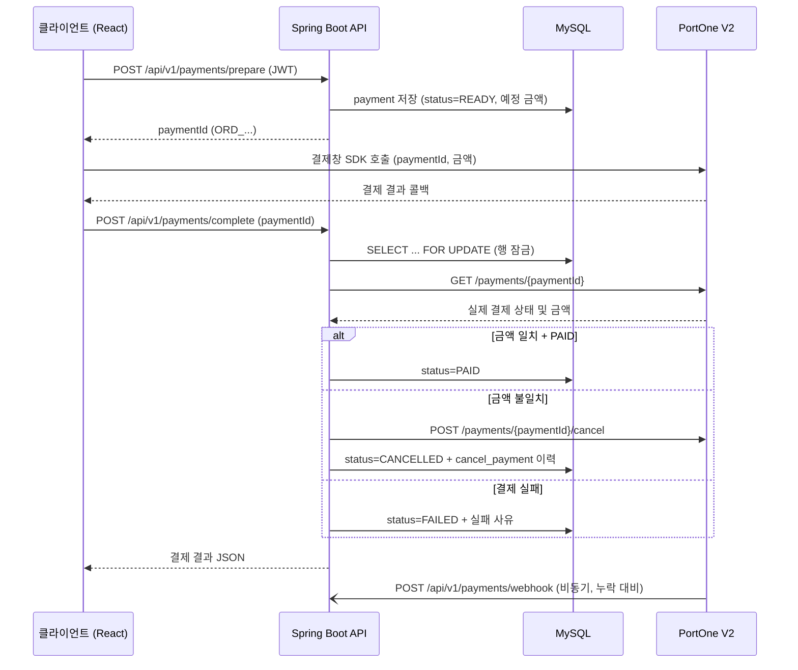
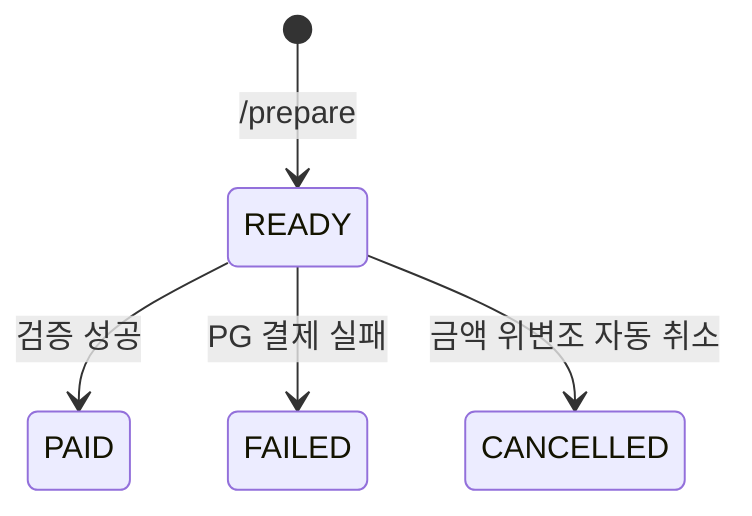

# 1. 시스템 아키텍처 설계서 (사자그램 SNS)

## 목차
- [1. 시스템 아키텍처 설계서 (사자그램 SNS)](#1-시스템-아키텍처-설계서-사자그램-sns)
- [1.1 시스템 아키텍처 개요](#11-시스템-아키텍처-개요)
- [1.2 AWS 인프라 및 배포 아키텍처](#12-aws-인프라-및-배포-아키텍처)
- [1.3 결제/구독 및 데이터 흐름도](#13-결제구독-및-데이터-흐름도)

---

## 1.1 시스템 아키텍처 개요

사자그램 플랫폼은 클라이언트와 서버가 물리적으로 완전히 분리된 계층형 REST API 아키텍처 채택.

---

## 1.2 AWS 인프라 및 배포 아키텍처

### 1.2.1 프론트엔드 호스팅 및 배포 (Netlify)
- **정적 사이트 빌드 및 자동 배포 (CI/CD)**:
  - GitHub 저장소(`main` 브랜치)와 Netlify를 연동하여 코드 `push` 시 정적 결과물(`dist`)을 자동 빌드 및 Netlify Edge 네트워크로 배포.
  - 배포 도메인: `https://petory-web.netlify.app` (Netlify 기본 SSL/TLS 인증서 적용).
- **SPA 라우팅 및 리다이렉트 설정**:
  - React SPA 특성상 상세 페이지에서 새로고침(F5) 시 발생하는 404 에러를 방지하도록 `netlify.toml` 기반 리다이렉트(`/*` ➔ `/index.html`, Status 200) 규칙 적용.
- **환경 변수(Environment Variables) 관리**:
  - 백엔드 API 엔드포인트(`VITE_API_BASE_URL=http://3.39.133.123`, Nginx 80 포트) 및 PortOne SDK 키(Store ID, Channel Key)를 Netlify 대시보드 환경 변수로 분리 등록.
  - 프론트엔드(HTTPS) ➔ 백엔드(HTTP) 호출은 브라우저 Mixed Content 정책에 의해 차단되므로, 도메인 연결 후 백엔드 HTTPS(443) 전환 예정.

### 1.2.2 백엔드 및 데이터베이스 배포 (AWS EC2 + Nginx + Docker Compose)
- **서버 환경**:
  - AWS EC2 (서울 리전 `ap-northeast-2`, Amazon Linux 2023, RAM 1GB + 스왑 2GB).
  - Docker 25 / Docker Compose v5 기반으로 애플리케이션과 DB를 컨테이너로 구성.
- **컨테이너 구성 (`docker-compose.yml`)**:
  - `petory-app`: Spring Boot API 서버 (Docker Hub `petory-backend:latest` 이미지, 8080 포트).
  - `petory-db`: MySQL 8.0 (3306 포트, `mysql-data` 볼륨으로 데이터 영속화).
  - `petory-app`은 `depends_on: service_healthy` 조건으로 MySQL 헬스체크(`mysqladmin ping`) 통과 후 기동하며, Compose 내부 네트워크의 서비스명(`mysql:3306`)으로 DB에 접속.
- **Nginx 리버스 프록시**:
  - EC2 호스트에 Nginx 1.30을 직접 설치하여 80 포트로 유입되는 모든 API 트래픽을 `127.0.0.1:8080`(Spring Boot 컨테이너)으로 포워딩.
  - `X-Real-IP`, `X-Forwarded-For`, `X-Forwarded-Proto` 헤더를 전달하여 클라이언트 원본 IP 및 프로토콜 정보 보존.
  - `client_max_body_size 10M`으로 요청 크기를 Spring Boot 기본 Multipart 제한(10MB)과 일치.
  - 설정 파일: `/etc/nginx/conf.d/petory.conf`, `systemctl enable`로 재부팅 시 자동 기동.
- **CI/CD 파이프라인 (GitHub Actions, `main` 브랜치 push 시 실행)**:
  1. **CI**: MySQL 8.0 서비스 컨테이너를 띄워 `./gradlew test`로 단위/통합 테스트 수행.
  2. **Delivery**: 테스트 통과 시 Docker 이미지를 빌드하여 Docker Hub에 `latest` 및 커밋 SHA 태그로 푸시.
  3. **Deploy**: `docker-compose.yml`을 SCP로 EC2에 전송하고, SSH로 접속하여 GitHub Secrets 기반 `.env` 생성 ➔ `docker compose pull` ➔ `docker compose up -d` ➔ 구버전 이미지 정리(`docker image prune`).

### 1.2.3 미디어 스토리지 및 파일 업로드 (AWS S3, 도입 예정)
- 현재 이미지는 외부 URL 문자열을 DB의 `image_url`, `profile_image` 컬럼에 저장하는 방식.
- S3 연동을 위한 설정값(`cloud.aws.credentials`, `cloud.aws.s3.bucket`, 리전 `ap-northeast-2`)과 CI/CD 시크릿(`AWS_ACCESS_KEY`, `AWS_SECRET_KEY`, `AWS_S3_BUCKET_NAME`)은 사전 등록 완료.
- 도입 예정 파이프라인:
  - 프론트엔드의 `multipart/form-data` 요청을 Spring Boot 서버가 수신.
  - AWS SDK for Java 2.x로 S3 버킷의 `uploads/posts/`, `uploads/profiles/` 경로에 UUID 파일명으로 업로드.
  - 업로드 후 생성된 S3 객체 URL을 DB의 `image_url` 컬럼에 저장.

### 1.2.4 도메인 간 리소스 공유 (CORS 정책)
- React 클라이언트(Netlify 도메인)와 Spring Boot API 서버(EC2) 간 통신을 위해 `WebConfig`(`WebMvcConfigurer`)에 CORS 정책을 정의하고, `SecurityConfig`의 `.cors(Customizer.withDefaults())`로 Security 필터 체인에도 동일하게 적용.
- 허용 오리진: `https://petory-web.netlify.app`, `http://localhost:5173`, `http://localhost:3000`
- 허용 메서드: GET, POST, PUT, PATCH, DELETE, OPTIONS
- 허용 헤더: 전체(`*`)
- 자격 증명 허용: `allowCredentials(true)`
- Preflight 캐시: 3600초

---

## 1.3 결제/구독 및 데이터 흐름도

PortOne V2 결제 게이트웨이를 사용하며, 클라이언트가 전달한 결제 결과를 신뢰하지 않고 서버가 PortOne REST API로 직접 재조회하여 금액 위변조를 차단하는 구조.

### 1.3.1 간식쏘기 단건 결제 및 사후 검증 흐름

1. **결제 준비 (클라이언트 ➔ 백엔드)**: `POST /api/v1/payments/prepare` (JWT 인증)
   - 요청: `targetMemberId`(후원 대상), `orderName`, `totalAmount`, `payMethod`
   - 본인 후원 차단, 대상 회원 존재 여부 검증.
   - 서버가 주문번호 `paymentId`(`ORD_{타임스탬프}_{UUID 8자리}`)를 생성하고 `payment` 테이블에 결제 예정 금액과 함께 `READY` 상태로 저장.
2. **결제창 호출 (클라이언트 ➔ PortOne)**: 발급받은 `paymentId`와 금액으로 PortOne 브라우저 SDK 결제창을 띄워 사용자가 결제 진행.
3. **사후 검증 (클라이언트 ➔ 백엔드)**: `POST /api/v1/payments/complete` (JWT 인증, 요청: `paymentId`)
   - `SELECT ... FOR UPDATE`로 결제 행을 잠가 중복/동시 요청을 순차 처리하고, 본인 주문인지 확인.
   - 이미 처리된 결제(`PAID`/`FAILED`/`CANCELLED`)는 PortOne 재호출 없이 현재 상태 반환 (멱등성 보장).
   - PortOne `GET https://api.portone.io/payments/{paymentId}` (`Authorization: PortOne {API Secret}`)로 실제 결제 내역 조회 후 상태 확정:
     - **PAID + 금액 일치** ➔ `PAID` 저장 (`transaction_id`, `pg_tx_id`, `receipt_url`, 한국 시간 `paid_at`).
     - **PAID + 금액 불일치** ➔ 위변조로 판단하여 PortOne 결제 취소 API 호출 ➔ `CANCELLED` 저장 및 `cancel_payment` 테이블에 취소 이력 기록.
     - **FAILED** ➔ `FAILED` 저장 (PG사 실패 코드/메시지).
     - **그 외(결제 진행 중)** ➔ DB 변경 없이 `READY` 반환.
   - 응답: `PAID`면 200 OK, 그 외 상태는 400 Bad Request + 상태/사유 JSON. PortOne 통신 실패 시 502 Bad Gateway.
4. **웹훅 수신 (PortOne ➔ 백엔드)**: `POST /api/v1/payments/webhook` (PortOne 서버 호출이므로 JWT 없이 `permitAll`)
   - 사용자가 결제 후 창을 닫는 등 3단계 호출이 누락되어도 결제 상태가 확정되도록 하는 보조 경로.
   - `Transaction.Paid`, `Transaction.Failed` 이벤트만 처리하고 그 외 이벤트는 무시.
   - 웹훅 본문은 신뢰하지 않고 `paymentId`만 추출하여 3단계와 동일한 PortOne 재조회 로직(`syncWithPortOne`)으로 상태 확정.
   - PortOne은 200 응답을 받지 못하면 재전송하므로, 처리 완료/무시한 경우 모두 200 OK 반환.

**결제 상태 전이**

### 1.3.2 VIP 정기 구독 빌링키 및 자동 결제 흐름 (구현 예정)
- DB 스키마(`subscription_plan`, `subscription`)는 설계 완료, 결제 로직은 구현 예정.
1. **구독 플랜 등록**: 크리에이터가 `subscription_plan` 테이블에 플랜명, 월 가격, 설명 등록.
2. **빌링키 발급**: 구독자가 PortOne SDK로 카드 정보를 입력하여 재사용 가능한 빌링키(`billingKey`) 발급.
3. **구독 정보 저장**: `subscription` 테이블에 구독자 ID, 대상 크리에이터 ID, 플랜 ID, 빌링키, 다음 결제 예정일(`next_billing_at`), 상태(`ACTIVE`) 기록.
4. **정기 결제 실행**: Spring Boot 스케줄러(`@Scheduled`)가 매일 실행되어 `next_billing_at`이 도래한 구독의 빌링키로 PortOne 빌링키 결제 API 호출.
5. **갱신 및 실패 처리**: 결제 성공 시 `next_billing_at`을 1개월 연장, 실패 시 구독 상태를 변경하고 `ended_at` 기록.
