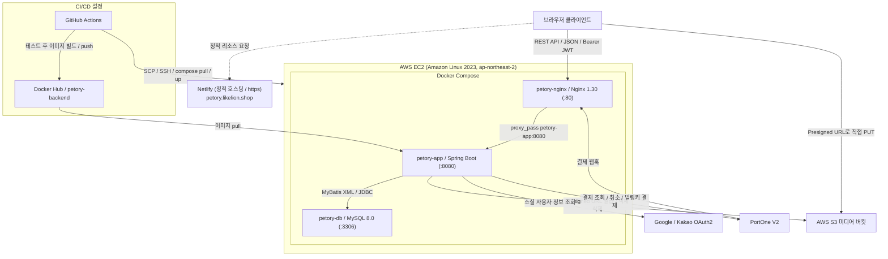
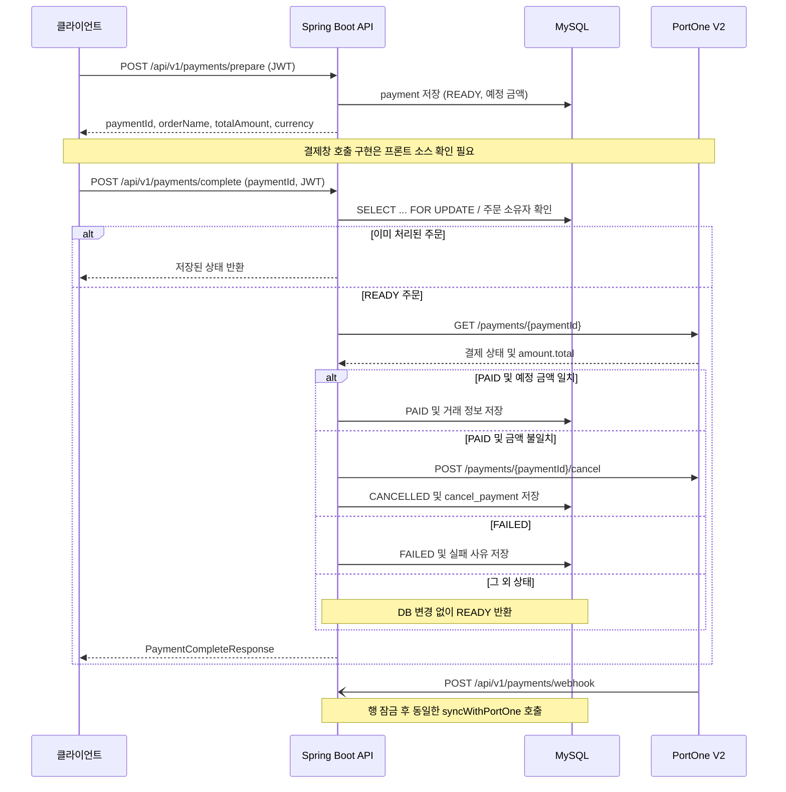
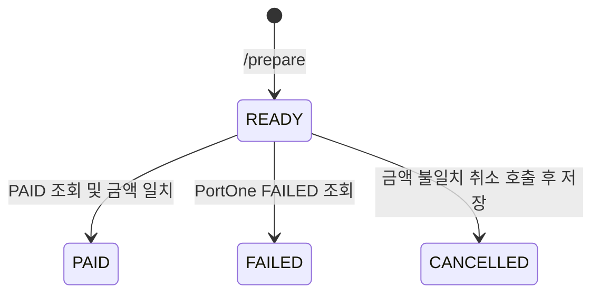

# 1. 시스템 아키텍처 설계서 (Petory)

## 목차

- [1. 시스템 아키텍처 설계서 (Petory)](#1-시스템-아키텍처-설계서-petory)
- [1.1 시스템 아키텍처 개요](#11-시스템-아키텍처-개요)
- [1.2 AWS 인프라 및 배포 아키텍처](#12-aws-인프라-및-배포-아키텍처)
- [1.3 결제/구독 및 데이터 흐름도](#13-결제구독-및-데이터-흐름도)

---

## 1.1 시스템 아키텍처 개요

Petory는 회원·반려동물 프로필, SNS 피드, QnA, 실종동물 신고, 후원 결제 및 구독을 제공하는 Spring Boot 기반 REST API 프로젝트.

- **사용 기술 및 주요 의존성**:
    - `build.gradle`: Java **25**, Spring Boot **4.0.8**, Spring Dependency Management **1.1.7**, MyBatis Spring Boot Starter **4.0.1**, springdoc OpenAPI **3.1.1**, JJWT **0.13.0**, AWS SDK BOM **2.31.78** 명시.
    - Spring Web MVC, Spring Security, OAuth2 Client, Bean Validation, MySQL Connector/J, Lombok 사용.
    - `gradle/wrapper/gradle-wrapper.properties`: Gradle **9.7.1** 지정. 테스트 의존성은 Spring Boot Test, Spring Security Test, MyBatis Test이며 `useJUnitPlatform()` 적용.

- **디렉터리 및 계층 구성**:
    - 실행 진입점: `src/main/java/net/likelion/bebc25/projectpatory/ProjectPatoryApplication.java`. 기본 패키지명은 코드 표기 그대로 `net.likelion.bebc25.projectpatory` 사용.
    - 기본 패키지 아래 `controller/`는 HTTP 요청·응답, `service/`는 인터페이스와 `*ServiceImpl` 업무 로직, `mapper/`는 `@Mapper` 인터페이스, `domain/`은 회원·결제·실종 신고 등의 모델, `dto/`는 요청·응답 및 조회 결과 모델 담당.
    - `security/`는 JWT·OAuth2·인증 처리, `config/`는 S3·RestClient 빈, `global/`은 CORS·RestTemplate 빈, `exception/`은 공통 예외 처리 담당. `running/RunningController`는 `GET /api/v1/running` 응답 제공.
    - `src/main/resources/mapper/`의 XML 12개에 SQL 정의. `application*.yaml`, `schema.sql`, `data.sql`은 연결·초기화 설정 담당. JPA Entity 및 Repository 계층 없이 MyBatis 사용.

- **DTO 및 API 처리 흐름**:
    - 기본 흐름: HTTP 요청 ➔ Security 필터 ➔ Controller ➔ Service ➔ Mapper 인터페이스·XML ➔ MySQL ➔ 응답 객체의 JSON 변환.
    - DTO는 Java `record`와 Lombok 클래스 혼용. 모든 기능이 Domain을 거치는 방식은 아니며, 게시글은 `PostCreateRequest`를 Mapper에 전달하고 조회 결과를 `PostListResponse` 등에 직접 매핑.
    - 실종 신고 상세는 `MissingPetMapper.findDetailById()`가 회원과 신고를 JOIN하여 `MissingPetDetailRow` 반환. `MissingPetServiceImpl`이 작성자를 `MemberSummaryResponse`로 묶고, `MissingPetReportRow` 목록을 변환하여 `MissingPetDetailResponse` 구성.
    - 게시글·팔로우 목록은 `SliceResponse<T>`, 실종 신고 목록은 `MissingPetListPageResponse`, 랭킹은 `RankingSliceResponse` 사용. 커서와 `size + 1` 조회로 다음 페이지 판단.

- **주요 기능별 아키텍처**:
    - **회원·프로필**: `MemberRestController` ➔ `MemberServiceImpl` ➔ `MemberMapper`. `POST /api/v1/signup`, `GET /api/v1/email/exists`, `GET /api/v1/nickname/exists` 제공. `GET /api/v1/profile/{memberId}`는 본인에게 `MyProfile`, 타인·비로그인 사용자에게 `MemberProfile` 반환. 수정·탈퇴는 각각 `POST /api/v1/profile/{memberId}/edit`, `POST /api/v1/profile/{memberId}/delete`이며 본인 여부 검사.
    - **게시글·QnA**: `PostController`·`PostServiceImpl`·`PostMapper`와 `QnaController`·`QnaServiceImpl`·`QnaMapper`로 구성. `/api/v1/posts`, `/api/v1/qna`에서 목록·상세·등록·수정·삭제 제공. 동일한 `post_main` 테이블에서 `type=1`은 피드, `type=2`는 QnA로 구분. 각 `/search` 경로는 해시태그 검색 제공.
    - **댓글·좋아요·북마크·조회수**: `CommentController`의 `/api/v1/posts/{postId}/comments`에서 등록, `/{commentId}`에서 PUT 수정·DELETE 삭제. 댓글 목록은 게시글 상세 응답에 포함. `PostInteractionController`·`PostLikeServiceImpl`은 POST `.../likes`, `PostBookmarkController`·`PostBookmarkServiceImpl`은 POST `.../bookmarks` 토글 처리. `PostInteractionMapper`가 `LIKE`, `BOOKMARK`, `VIEW`를 구분하며 로그인 사용자의 상세 조회는 `INSERT IGNORE`로 중복 조회 기록 방지.
    - **팔로우·랭킹**: `FollowController` ➔ `FollowServiceImpl` ➔ `FollowMapper`. `/api/v1/profile/{memberId}/follow`는 POST·DELETE 모두 동일한 토글 메서드 호출. `/followers`, `/followings`에서 커서 목록 제공. `RankingController`·`RankingServiceImpl`·`RankingMapper`는 `GET /api/v1/ranking`에서 ACTIVE 회원을 팔로워 수 내림차순·회원 ID 내림차순으로 조회.
    - **실종동물 신고**: `MissingPetController` ➔ `MissingPetServiceImpl` ➔ `MissingPetMapper`. `/api/v1/missing-pets`에서 GET 목록·POST 등록, `/{id}`에서 GET 상세·PUT 수정, `/{id}/status`에서 PATCH 상태 변경. 등록 상태는 `MISSING`, 작성자만 수정 가능하며 `MISSING`에서 `FOUND` 또는 `CANCELLED`로 변경.
    - **지도·목격 제보**: 신고와 제보의 주소·위도·경도 저장 및 조회 구조 존재. Java 좌표는 `BigDecimal`, DB는 `DECIMAL(10, 7)` 사용.
    - **결제·구독**: `PaymentController`, `SubscriptionController`, `SubscriptionPaymentController`와 각 Service·Mapper로 구성.
    - **관리자**: `AdminMemberRestController` ➔ `AdminMemberServiceImpl` ➔ `MemberMapper`. `GET /api/v1/admin/members` 회원 목록과 `PATCH /api/v1/admin/members/{memberId}/block`의 `BLOCKED` 상태 변경 구현.

- **주요 도메인 및 DB 관계**:
    - `member` 중심으로 `linked_account`, `issued_refresh_token`, `post_main`, `missing_pet_post`, `subscription_plan` 등이 회원 ID 참조. `follow`는 `follower_id`와 `following_id`로 회원 간 관계 표현.
    - `post_main`에 `post_image`, `comment`, `post_interaction` 연결. 회원·게시글·인터랙션 종류의 복합 UNIQUE 제약으로 동일 종류 중복 기록 제한.
    - `missing_pet_post`에 `missing_pet_report` 연결. 신고 작성자와 제보 작성자는 각각 `member` 참조.
    - `payment`는 결제자와 대상 회원을 참조하고 `payment_id` 주문번호에 UNIQUE 적용. `cancel_payment.payment_id`는 문자열 주문번호가 아닌 `payment.id` PK 참조.
    - `subscription`은 구독자·대상 회원·`subscription_plan` 참조. Java 클래스 `Subscription`은 **플랜**, `SubscriptionRecord`는 **가입 구독**을 나타냄. 해당 외래 키에는 `ON DELETE CASCADE` 정의.

- **인증 및 인가 구조**:
    - `AuthRestController`의 `POST /api/v1/login` ➔ `AuthenticationManager`·`CustomUserDetailsService` ➔ `MemberMapper`로 이메일·비밀번호 인증. `PasswordEncoderConfig`의 `BCryptPasswordEncoder`로 회원가입 비밀번호 해시 처리.
    - `JwtProvider`가 Access Token과 Refresh Token 발급. 설정상 유효기간은 각각 1시간·7일. `RefreshTokenServiceImpl`·`RefreshTokenMapper`가 `issued_refresh_token`에 저장하고, `POST /api/v1/refresh`에서 토큰 검증·DB 조회 후 새 토큰 발급 및 기존 행 갱신.
    - `JwtAuthenticationFilter`는 `Authorization: Bearer {token}`을 검증하고 회원을 재조회하여 SecurityContext 구성. Controller는 `@AuthenticationPrincipal CustomUserDetails`로 로그인 회원 ID 사용. `SecurityConfig`는 STATELESS, CSRF·HTTP Basic·폼 로그인 비활성화 설정.
    - 비로그인 허용 범위는 로그인·갱신·회원가입·중복 확인, 게시글 GET, 단일 프로필 및 프로필 피드 GET, 결제 웹훅 POST, Swagger 등 명시 경로. QnA·실종동물·팔로우·랭킹 등 나머지 업무 API는 인증 필요.
    - `CustomOAuth2UserService`가 Google·Kakao 사용자 정보를 조회하고 이메일 기준으로 회원 확인. 신규 회원은 `member`·`linked_account`에 저장. `OAuth2SuccessHandler`는 자체 JWT 발급 후 `https://petory.likelion.shop`으로 토큰을 쿼리 파라미터에 담아 리다이렉트.

- **예외 처리 구조**:
    - `GlobalRestExceptionHandler`가 `ApiErrorResponse(code, message, status, timestamp, errors)`로 오류 반환. 유효성 검증·`IllegalArgumentException`은 400, 인증 예외는 401, `AccessDeniedException`·`IllegalStateException`은 403, `NoSuchElementException`은 404, `PaymentGatewayException`은 502, 기타 예외는 500 처리.
    - 필터 체인의 인증·인가 오류는 `CustomAuthenticationEntryPoint`와 `CustomAccessDeniedHandler`가 처리. 실종 신고의 타인 수정·상태 변경은 `AccessDeniedException`을 사용하여 403 반환.
    - 게시글·댓글의 일부 권한 오류와 없는 실종 신고 조회는 현재 `IllegalArgumentException`으로 400 처리. `DuplicateResourceException` 전용 핸들러는 없어 일반 500 처리 대상. 모든 기능에 동일한 오류 분류가 적용된 것으로 기술하지 않음.

- **Swagger / OpenAPI 구성**:
    - `springdoc-openapi-starter-webmvc-ui`와 `application.yaml` 설정으로 `/swagger-ui.html`, `/v3/api-docs` 제공. 기본 응답 미디어 타입은 `application/json`, 태그·작업 정렬은 `alpha` 설정.
    - Controller·DTO의 `@Tag`, `@Operation`, `@ApiResponses`, `@Schema` 기반으로 API 문서 생성. 두 문서 경로는 Security에서 비로그인 접근 허용.

---

## 1.2 AWS 인프라 및 배포 아키텍처

### 1.2.1 프론트엔드 호스팅 및 배포 (Netlify)

- **프론트엔드 연결 근거**:
    - `WebConfig`에서 `https://petory-web.netlify.app`, `https://petory.likelion.shop`을 허용 오리진으로 정의. OAuth2 인증 성공 리다이렉트 주소도 `https://petory.likelion.shop`으로 지정.
    - 백엔드는 REST API·JWT·업로드용 URL을 제공하고, 브라우저는 이를 호출하여 화면을 구성하는 경계.
- **정적 사이트 빌드 및 자동 배포 (CI/CD)**:
    - 프론트 저장소·`package.json`·Netlify 설정이 없어 빌드 명령, `dist` 출력 경로, `main` 자동 배포
- **SPA 라우팅 및 리다이렉트 설정**:
    - `netlify.toml`·`_redirects`가 없어 `/*` ➔ `/index.html`
- **환경 변수(Environment Variables) 관리**:
    - `VITE_API_BASE_URL`, PortOne 브라우저 SDK 키, 카카오맵 JavaScript 키의 사용·등록
    - 백엔드 도메인 `petory-api.likelion.shop`은 Nginx와 OAuth2 설정에 존재.

### 1.2.2 백엔드 및 데이터베이스 배포 (AWS EC2 + Nginx + Docker Compose)

- **서버 환경**:
    - `.github/workflows/cicd-full.yml`에 EC2 대상 SCP·SSH 배포 정의. 호스트·계정·키는 `EC2_HOST`, `EC2_USERNAME`, `EC2_SSH_KEY` 시크릿 사용.
    - 실제 EC2 리전·OS·메모리·스왑 용량, Docker 엔진·Compose 설치 버전 및 배포 성공
- **컨테이너 구성 (`docker-compose.yml`)**:
    - `mysql`: `mysql:8.0`, 컨테이너명 `petory-db`, 호스트 `3306:3306`, `mysql-data:/var/lib/mysql` 볼륨 사용.
    - `petory-app`: `${DOCKERHUB_USERNAME}/petory-backend:latest`, 컨테이너명 `petory-app`. 호스트 바인딩은 `127.0.0.1:8080:8080`. `depends_on: service_healthy`로 MySQL 헬스체크 통과 후 기동.
    - `nginx`: `nginx:1.30-alpine`, 컨테이너명 `petory-nginx`, `80:80` 공개. `nginx/petory.conf`를 `/etc/nginx/conf.d/default.conf`에 읽기 전용 마운트. 세 서비스 모두 `restart: always` 설정.
    - `Dockerfile`은 Temurin 25 JDK Alpine에서 `bootJar -x test` 빌드 후 Temurin 25 JRE Alpine으로 JAR 복사. 최종 컨테이너는 `appuser`로 실행.
- **MySQL 연결 및 초기화**:
    - Compose는 `SPRING_DATASOURCE_URL=jdbc:mysql://mysql:3306/${MYSQL_DATABASE}?...` 주입. 애플리케이션은 Compose 서비스명 `mysql`로 DB 접속하며 사용자·비밀번호는 환경변수로 전달.
    - 기본 `application.yaml`은 `DB_HOST`, `DB_PORT`와 DB명 `petory-db` 사용. `application-local.yaml`은 `localhost:3307/petory_db` 지정.
    - MyBatis는 `classpath:mapper/**/*.xml`, DTO 패키지 별칭, `map-underscore-to-camel-case: true` 설정 사용.
- **Nginx 리버스 프록시**:
    - `server_name petory-api.likelion.shop`, `listen 80`, `proxy_pass http://petory-app:8080`으로 Compose 내부 API 서버에 전달.
    - `Host`, `X-Real-IP`, `X-Forwarded-For`, `X-Forwarded-Proto` 전달, `client_max_body_size 10M` 설정.
- **CI/CD 파이프라인 (`main` 브랜치 push 시 실행하도록 정의)**:
    1. **CI**: Java 25와 MySQL 8.0 서비스 컨테이너를 준비하고 `./gradlew test` 실행.
    2. **Delivery**: CI 성공 후 Docker 이미지 빌드, Docker Hub에 `latest`·커밋 SHA 태그 푸시.
    3. **Deploy**: `docker-compose.yml`, `nginx/petory.conf`를 `/home/ec2-user`로 SCP 전송. SSH에서 시크릿 기반 `.env` 생성 ➔ `docker compose pull` ➔ `docker compose up -d` ➔ `docker image prune -f` 실행.
- **백엔드 환경변수 관리**:
    - `application.yaml`이 `optional:file:.env[.properties]`, `optional:application-oauth.yaml`을 import. Compose는 루트 `.env`를 치환한 후 필요한 값을 컨테이너 환경변수로 주입.
    - DB·Docker Hub 외에 `JWT_SECRET`, `AWS_ACCESS_KEY`, `AWS_SECRET_KEY`, `AWS_S3_BUCKET_NAME`, `PORTONE_STORE_ID`, `PORTONE_API_SECRET`, `GOOGLE_CLIENT_ID/SECRET`, `KAKAO_CLIENT_ID/SECRET` 사용.
    - CI 테스트 단계의 AWS 변수명은 `AWS_ACCESS_KEY_ID`, `AWS_SECRET_ACCESS_KEY`, `AWS_S3_BUCKET`
    - 기본 OAuth2 콜백은 HTTPS 도메인으로 지정되어 있으나, 첨부 `application-oauth.yaml`에는 `{baseUrl}/login/oauth2/code/{registrationId}` 정의.

### 1.2.3 미디어 스토리지 및 파일 업로드 (AWS S3)

- `S3Config`에서 `S3Client`, `S3Presigner` 생성. `cloud.aws.credentials`, `cloud.aws.s3.bucket`, 리전 `ap-northeast-2` 설정 사용.
- **업로드 파이프라인**:
    1. 인증된 사용자가 `POST /api/v1/files/presign`으로 `PresignUploadRequest(filename, contentType)` 전송.
    2. `FileController` ➔ `S3ServiceImpl.createPresignedUpload()`에서 Content-Type·확장자 형식 검사 후 `uploads/posts/{memberId}/{UUID}{확장자}` 키 생성.
    3. 유효기간 **10분**의 PUT용 Presigned URL 발급. `PresignUploadResponse`에 `uploadUrl`, `fileUrl`, `key` 반환.
    4. 클라이언트가 `uploadUrl`로 S3에 파일을 직접 PUT하고, 게시글 등록 요청의 `imageUrls`로 파일 URL 전달. `PostMapper`가 `post_main`·`post_image`에 본문과 이미지 URL 저장.
- 허용 Content-Type은 `image/jpeg`, `image/png`, `image/webp`, `image/gif`, `audio/mpeg`, `audio/mp4`, `audio/wav`. 이미지 외 BGM 파일 업로드도 허용하는 구현.
- 게시글·QnA 삭제는 `PostServiceImpl.deletePost()`가 작성자 조건으로 DB 삭제 후 `S3ServiceImpl.deleteObjectsByFileUrls()` 호출. 설정된 버킷 URL로 시작하는 첨부 이미지 객체만 삭제.

### 1.2.4 도메인 간 리소스 공유 (CORS 정책)

- `global/WebConfig`의 `WebMvcConfigurer`에서 `/**`에 정책 정의. `SecurityConfig`의 `.cors(Customizer.withDefaults())`로 Security 필터에도 적용.
- 허용 오리진 패턴: `https://petory-web.netlify.app`, `https://petory.likelion.shop`, `http://localhost:5173`, `http://localhost:3000`
- 허용 메서드: GET, POST, PUT, PATCH, DELETE, OPTIONS
- 허용 헤더: 전체(`*`)
- 자격 증명 허용: `allowCredentials(true)`
- Preflight 캐시: 3600초
---

## 1.3 결제/구독 및 데이터 흐름도

PortOne V2 REST API를 사용하며, `PaymentServiceImpl`이 저장된 주문 금액과 PortOne 조회 결과를 비교하여 결제 상태를 확정하는 구조. 단건 결제는 `RestTemplate`, 빌링키 조회·결제는 `SubscriptionPaymentServiceImpl`의 `RestClient` 사용.

### 1.3.1 간식쏘기 단건 결제 및 사후 검증 흐름

1. **결제 준비 (클라이언트 ➔ 백엔드)**: `POST /api/v1/payments/prepare`
    - `PaymentController`가 JWT 회원 ID와 `PaymentPrepareRequest`를 `PaymentServiceImpl.preparePayment()`에 전달. 요청은 `targetMemberId`, `orderName`, `totalAmount`, `merchandise`이며 `@Valid`로 필수값·양수 금액 등을 검사.
    - 본인 후원과 없는 대상 회원을 차단. 주문번호 `ORD_{타임스탬프}_{UUID 8자리}` 생성 후 `PaymentMapper.savePayment()`로 KRW·예정 금액 저장, DB 기본 상태는 `READY`.
    - 단건 결제의 예정 금액은 요청에서 전달받아 저장하는 구조.
2. **결제창 호출 (클라이언트 ➔ PortOne)**:
    - 백엔드는 `PaymentPrepareResponse(paymentId, orderName, totalAmount, currency)` 제공.
3. **사후 검증 (클라이언트 ➔ 백엔드)**: `POST /api/v1/payments/complete`
    - `verifyAndCompletePayment()`가 `findByPaymentIdForUpdate()`의 `SELECT ... FOR UPDATE`로 결제 행 잠금. 없는 주문 및 타인 주문은 `IllegalArgumentException`으로 400 처리.
    - `syncWithPortOne()`에서 `READY`가 아닌 주문은 외부 재조회 없이 현재 상태 반환. 상태 UPDATE에도 `AND status = 'READY'` 적용.
    - `GET https://api.portone.io/payments/{paymentId}`에 `Authorization: PortOne {API Secret}` 전달. `RestTemplateConfig`의 연결 제한 3초·읽기 제한 10초 적용.
    - **PAID + 저장 금액과 `amount.total` 일치** ➔ `PAID`, 거래 ID, PG 거래 ID, 영수증 URL, 결제금액·한국 시간 결제일 저장.
    - **PAID + 금액 불일치** ➔ `/payments/{paymentId}/cancel` 호출 후 `CANCELLED` 처리 및 `cancel_payment` 이력 저장.
    - **FAILED** ➔ 실패 코드·메시지 저장. **그 외 상태** ➔ DB 변경 없이 `READY` 응답.
    - `PaymentCompleteResponse`의 상태가 `PAID`면 200, 그 외는 400 반환. PortOne 조회 404는 404, 그 외 통신 오류·잘못된 조회 응답은 `PaymentGatewayException`으로 502 처리.
4. **웹훅 및 결제내역**:
    - `POST /api/v1/payments/webhook`은 JWT 없이 허용. `Transaction.Paid`, `Transaction.Failed`만 처리하며 주문번호 누락·없는 주문·기타 이벤트는 무시.
    - 웹훅의 결제 상태를 그대로 저장하지 않고 DB 행 잠금 후 동일한 `syncWithPortOne()`으로 확인. 정상 처리·무시는 200, 처리 중 예외는 공통 예외 처리 적용.
    - `GET /api/v1/payments/me`는 로그인 회원의 결제 기록을 최신 생성일순으로 조회하여 `PaymentHistoryResponse` 목록 반환.

**결제 상태 전이**

### 1.3.2 정기 구독 빌링키 및 자동 결제 흐름

- 구독 플랜 CRUD, 빌링키 검증·첫 결제, 구독 조회·동의 변경·해지, 정기 결제 스케줄러가 실제 코드에 존재.

1. **구독 플랜 등록·관리**:
    - `SubscriptionController`의 `/api/v1/subscriptionPlan/{memberId}`에서 POST 생성·GET 목록·PUT 수정·DELETE 삭제 제공. 삭제 시 쿼리 파라미터 `id`로 플랜 지정.
    - `SubscriptionServiceImpl`이 생성·수정·삭제의 소유자를 검증하고 `SubscriptionMapper`가 `subscription_plan`에 반영. 수정 항목은 이름·설명·상태이며 가격은 변경하지 않음.
    - 플랜 DELETE는 물리 삭제이며 FK CASCADE로 관련 `subscription`도 삭제되는 구조. 가입 구독의 해지와 구분.
2. **빌링키 확인 및 첫 결제**:
    - `POST /api/v1/subscription/{memberId}`에서 경로 ID는 **구독 대상 회원**, 구독자는 JWT 회원. `SubscriptionRecordCreateRequest(targetMemberId, planId, billingKey)` 사용.
    - `SubscriptionPaymentServiceImpl`이 플랜 존재·삭제 상태, 본인 구독, 대상 회원 일치, 같은 플랜의 ACTIVE 중복 구독 검사.
    - `GET https://api.portone.io/billing-keys/{billingKey}`로 `ISSUED` 상태와 키 일치 확인.
    - DB 플랜의 가격·이름으로 `PaymentService.preparePayment()` 호출, `merchandise=automaticPayment` 지정. 이어 `POST /payments/{paymentId}/billing-key`로 결제 후 `verifyAndCompletePayment()` 재조회. `PAID`인 경우에만 가입 정보 저장.
3. **구독 정보 저장·조회·변경**:
    - `SubscriptionPaymentMapper`가 `subscription`에 회원·대상 회원·플랜·빌링키와 다음 결제일 저장. 다음 결제일은 현재 날짜의 1개월 후, 기본 상태는 `ACTIVE`, `agreement=1`.
    - `GET /api/v1/subscription/{memberId}`와 `GET /api/v1/subscription/{memberId}/{subscriptionRecordId}`에서 본인 구독 조회. 조회·변경·해지 경로의 `memberId`는 **구독자 본인**을 의미.
    - 동일한 상세 경로의 PUT으로 `agreement` 변경, DELETE로 `CANCELLED`·종료일 기록 및 `next_billing_at=NULL` 처리. 가입 구독 해지는 행을 삭제하지 않음.
4. **정기 결제 실행**:
    - `ProjectPatoryApplication`의 `@EnableScheduling`과 `billDueSubscriptions()`의 `@Scheduled(cron = "0 0 9 * * *", zone = "Asia/Seoul")`로 매일 한국 시간 오전 9시 실행하도록 설정.
    - 대상은 `status='ACTIVE'`, `agreement=1`, `next_billing_at <= CURDATE()`인 구독. 저장된 빌링키로 새 주문 생성 ➔ 빌링키 결제 ➔ 단건 결제와 동일한 사후 검증 수행.
5. **갱신 및 실패 처리**:
    - `PAID`면 현재 날짜 기준 1개월 후로 다음 결제일 갱신. `FAILED`, 처리 중 예외, 없거나 `DELETED`·`PENDING_DELETION`인 플랜은 구독 해지 처리.
    - `READY`·`CANCELLED` 검증 결과를 처리하는 별도 갱신 분기는 없음. `agreement=false`는 자동 청구 대상에서 제외되지만 즉시 해지하지 않음.