# 1. 데이터베이스 모델링 및 ERD 명세서 (사자그램 SNS)

## 목차
- [1. 데이터베이스 모델링 및 ERD 명세서 (사자그램 SNS)](#1-데이터베이스-모델링-및-erd-명세서-사자그램-sns)
- [1.1 엔티티 관계 다이어그램 (ERD)](#11-엔티티-관계-다이어그램-erd)
- [1.2 테이블별 상세 컬럼 명세](#12-테이블별-상세-컬럼-명세)

---

## 1.1 엔티티 관계 다이어그램 (ERD)

사자그램 서비스의 7개 핵심 도메인 테이블과 결제 및 정기 구독을 위한 2개 테이블의 전체 구조도.

```mermaid
erDiagram
    member ||--o{ post_main : "작성함 (1:N)"
    member ||--o{ comment : "작성함 (1:N)"
    member ||--o{ post_interaction : "인터랙션함 (1:N)"
    member ||--o{ payment : "결제함 (1:N)"
    member ||--o{ subscription_plan : "플랜생성함 (1:N)"
    member ||--o{ subscription : "구독함 (1:N)"
    member ||--o{ follow : "팔로우함 (1:N)"
    member ||--o{ notifications : "알림받음 (1:N)"
    member ||--o{ chat_room : "채팅참여함 (1:N)"
    member ||--o{ chat_message : "메시지전송함 (1:N)"
    member ||--o{ missing_pet_post : "실종신고함 (1:N)"
    member ||--o{ missing_pet_report : "제보함 (1:N)"

    post_main ||--o{ post_image : "포함함 (1:N)"
    post_main ||--o{ comment : "달림 (1:N)"
    post_main ||--o{ post_interaction : "받음 (1:N)"

    missing_pet_post ||--o{ missing_pet_report : "제보받음 (1:N)"
    chat_room ||--o{ chat_message : "포함함 (1:N)"

    member {
        BIGINT id PK "회원 고유 식별자"
        VARCHAR email "로그인 아이디 (이메일)"
        VARCHAR password "BCrypt 암호화된 비밀번호"
        VARCHAR nickname "화면 표시용 닉네임"
        VARCHAR species "동물 종 카테고리"
        VARCHAR sex "성별"
        DATE birth_date "생년월일"
        VARCHAR intro "한줄 자기소개"
        VARCHAR profile_image "회원 프로필 사진 S3 URL"
        VARCHAR address "회원주소"
        VARCHAR status "계정 상태 (ACTIVE, BLOCKED)"
        VARCHAR role "권한 (ROLE_USER, ROLE_VIP, ROLE_ADMIN)"
        DATETIME created_at "계정 생성 일시"
        DATETIME info_provide_agreement "개인정보 제3자 제공 동의 일시"
    }

    post_main {
        BIGINT id PK "피드 게시글 고유 식별자"
        BIGINT member_id FK "작성자 회원 ID"
        TEXT content "피드 본문 내용"
        VARCHAR bgm_url "배경음악 S3 URL"
        TINYINT is_subscriber_only "유료 구독자 전용 여부"
        TEXT hashtags "해시태그 문자열"
        DATETIME created_at "피드 최초 작성 일시"
        DATETIME updated_at "피드 최종 수정 일시"
    }

    post_image {
        BIGINT id PK "이미지 식별자"
        BIGINT post_id FK "피드 게시글 식별자"
        VARCHAR image_url "피드 첨부 이미지 S3 URL"
        INT sort_order "이미지 슬라이드 순서"
    }

    comment {
        BIGINT id PK "댓글 고유 식별자"
        BIGINT post_id FK "댓글이 달린 피드 식별자"
        BIGINT member_id FK "댓글 작성자 식별자"
        TEXT content "댓글 텍스트 내용"
        DATETIME created_at "댓글 등록 일시"
    }

    post_interaction {
        BIGINT id PK "좋아요/북마크 식별자"
        BIGINT member_id FK "회원 ID"
        BIGINT post_id FK "대상 피드 게시글 ID"
        VARCHAR type "인터랙션 유형(LIKE, BOOKMARK)"
        DATETIME created_at "등록 일시"
    }

    payment {
        BIGINT id PK "결제 내역 식별자"
        BIGINT member_id FK "결제 회원 ID"
        BIGINT target_member_id FK "후원 대상 동물 유저 ID"
        VARCHAR imp_uid "결제 승인 고유 번호"
        VARCHAR merchant_uid "자체 생성 주문 식별자"
        INT amount "결제 금액"
        VARCHAR category "결제 상품"
        VARCHAR status "결제 상태"
        VARCHAR pay_type "결제 수단"
        DATETIME created_at "결제 요청 시각"
        DATETIME completed_at "결제 완료 시각"
    }

    subscription_plan {
        BIGINT id PK "구독 플랜 식별자"
        BIGINT member_id FK "해당 플랜을 만든 회원 식별자"
        VARCHAR plan_name "플랜 이름"
        INT price "플랜 가격"
        TEXT description "플랜 설명"
    }

    subscription {
        BIGINT id PK "구독 식별자"
        BIGINT member_id FK "구독 회원 식별자"
        BIGINT target_member_id FK "구독 대상 회원 식별자"
        VARCHAR plan_id "구독 플랜 식별자"
        VARCHAR customer_uid "정기 결제 카드 빌링키"
        VARCHAR status "구독 상태"
        DATETIME started_at "시작일"
        DATETIME ended_at "만료일"
        DATETIME next_billing_at "다음 자동 결제 예정일"
        TINYINT agreement "자동결제 동의여부"
    }

    follow {
        BIGINT id PK "팔로우 식별자"
        BIGINT follower_id FK "팔로우 하는 회원 ID"
        BIGINT following_id FK "팔로우 대상 회원 ID"
        DATETIME created_at "팔로우 일시"
    }

    notifications {
        BIGINT id PK "알림 식별자"
        BIGINT member_id FK "수신 회원 식별자"
        BIGINT sender_id FK "알림 유발 회원 ID"
        VARCHAR notification_type "알림 유형"
        VARCHAR al_content "알림 메시지 내용"
        TINYINT is_checked "알림 확인 여부"
        DATETIME created_at "알림 발생 시각"
    }

    chat_room {
        BIGINT id PK "채팅방 식별자"
        BIGINT member1_id FK "채팅 참여자 1"
        BIGINT member2_id FK "채팅 참여자 2"
        TINYINT member1_exited "참여자 1 나가기 여부"
        TINYINT member2_exited "참여자 2 나가기 여부"
        DATETIME created_at "채팅방 생성 일시"
    }

    chat_message {
        BIGINT id PK "메시지 식별자"
        BIGINT room_id FK "속한 채팅방 ID"
        BIGINT sender_id FK "메시지 보낸 사람 ID"
        TEXT message "메시지 본문"
        DATETIME created_at "메시지 전송 시각"
    }

    missing_pet_post {
        BIGINT id PK "실종 신고 게시글 고유 ID"
        BIGINT member_id FK "작성자 회원 ID"
        DATE missing_date "실종일자"
        VARCHAR missing_address "실종장소"
        TEXT detail "특이사항"
        VARCHAR image_url "대표사진 S3 URL"
        VARCHAR status "상태"
        DECIMAL latitude "위도"
        DECIMAL longitude "경도"
        DATETIME created_at "작성 시각"
        DATETIME updated_at "게시글 수정 일시"
    }

    missing_pet_report {
        BIGINT id PK "제보 식별자"
        BIGINT missing_pet_post_id FK "대상 실종 신고 게시글 ID"
        BIGINT member_id FK "제보자 회원 ID"
        VARCHAR address "목격 장소"
        TEXT detail "목격 상황 및 상태 설명"
        VARCHAR image_url "제보 이미지 S3 URL"
        DATETIME sight_at "실제 동물을 목격한 일시"
        DECIMAL latitude "위도"
        DECIMAL longitude "경도"
        DATETIME created_at "제보 등록 일시"
        DATETIME updated_at "제보 수정 일시"
    }
```

---

## 1.2 테이블별 상세 컬럼 명세

### 1.2.1 member (회원 기본)
| 컬럼명                    | 데이터 타입       | 제약 조건                         | 설명                                   |
|:-----------------------|:-------------|:------------------------------|:-------------------------------------|
| id                     | BIGINT       | PK, AUTO_INCREMENT            | 회원 고유 식별자                            |
| email                  | VARCHAR(100) | NULL, UNIQUE                  | 로그인 아이디 (이메일)                        |
| password               | VARCHAR(255) | NULL                          | BCrypt 암호화된 비밀번호                     |
| nickname               | VARCHAR(50)  | NOT NULL                      | 화면 표시용 닉네임                           |
| species                | VARCHAR(50)  | NOT NULL                      | 동물 종 카테고리 (개, 고양이 등)                 |
| sex                    | VARCHAR(10)  | NOT NULL                      | 성별                                   |
| birth_date             | DATE         | NOT NULL                      | 생년월일                                 |
| intro                  | VARCHAR(255) | NULL                          | 한줄 자기소개                              |
| profile_image          | VARCHAR(255) | NULL                          | 회원 프로필 사진 S3 URL                     |
| address                | VARCHAR(255) | NULL                          | 회원주소                                 |
| status                 | VARCHAR(50)  | NOT NULL, DEFAULT 'ACTIVE'    | 계정 상태 (ACTIVE, BLOCKED)              |
| role                   | VARCHAR(20)  | NOT NULL, DEFAULT 'ROLE_USER' | 권한 (ROLE_USER, ROLE_VIP, ROLE_ADMIN) |
| created_at             | DATETIME     | DEFAULT CURRENT_TIMESTAMP     | 계정 생성 일시                             |
| info_provide_agreement | DATETIME     | Null                          | 개인정보 제3자 제공 동의 일시                    |

### 1.2.1-1 linked_account (회원 기본)

| 컬럼명              | 데이터 타입       | 제약 조건                         | 설명                            |
|:-----------------|:-------------|:------------------------------|:------------------------------|
| id               | BIGINT       | PK, AUTO_INCREMENT            | 서드파티 계정정보 식별자                 |
| member_id        | BIGINT       | FK, NOT NULL                  | 회원 고유 식별자                     |
| provider         | VARCHAR(50)  | NOT NULL                      | 연동된 외부 계정 제공자 (GOOGLE, KAKAO) |
| provider_user_id | VARCHAR(50)  | NOT NULL                      | 계정 제공자가 전달해 준 회원의 ID          |
| provider_email   | VARCHAR(50)  | NOT NULL                      | 계정 제공자가 전달해 준 회원의 email       |
| created_at       | DATETIME     | DEFAULT CURRENT_TIMESTAMP     | 계정 생성 일시                      |

### 1.2.2 post_main (피드 게시글)
| 컬럼명                | 데이터 타입       | 제약 조건                                                 | 설명                               |
|:-------------------|:-------------|:------------------------------------------------------|:---------------------------------|
| id                 | BIGINT       | PK, AUTO_INCREMENT                                    | 피드 게시글 고유 식별자                    |
| member_id          | BIGINT       | NOT NULL, FK(member.id ON DELETE CASCADE)             | 작성자 회원 ID                        |
| type               | TINYINT      | NOT NULL, DEFAULT 1                                   | 게시글 유형 (1: 일반 피드, 2: Q&A 게시글)    |
| content            | TEXT         | NOT NULL                                              | 피드 본문 내용                         |
| bgm_url            | VARCHAR(255) | NULL                                                  | 배경음악 S3 URL                      |
| is_subscriber_only | TINYINT(1)   | NOT NULL, DEFAULT 0                                   | 유료 구독자 전용 여부 (0: 전체공개, 1: 구독자전용) |
| hashtags           | TEXT         | NULL                                                  | 해시태그 문자열 (예: "#강아지 #산책 #일상")     |
| created_at         | DATETIME     | DEFAULT CURRENT_TIMESTAMP                             | 피드 최초 작성 일시                      |
| updated_at         | DATETIME     | DEFAULT CURRENT_TIMESTAMP ON UPDATE CURRENT_TIMESTAMP | 피드 최종 수정 일시                      |

### 1.2.3 post_image
| 컬럼명        | 데이터 타입       | 제약 조건                                         | 설명               |
|:-----------|:-------------|:----------------------------------------------|:-----------------|
| id         | BIGINT       | PK, AUTO_INCREMENT                            | 이미지 식별자          |
| post_id    | BIGINT       | NOT NULL, FK (post_main.id ON DELETE CASCADE) | 피드 게시글 식별자       |
| image_url  | VARCHAR(255) | NOT NULL                                      | 피드 첨부 이미지 s3 URL |
| sort_order | INT          | NOT NULL, DEFAULT 0                           | 이미지 슬라이드 순서      |

1:n구조 게시글하나에 여러 장의 사진이 올라가므로 single 테이블 방식으로는 깔금하게 저장 관리하기 어렵다.
db저장 특성상 자동정렬이 되지 않아서 유저가 올린 사진 순서와 펫 클럽 슬라이스 ui를 올바르게 렌더링하기 위해 sort_order가 필요

### 1.2.4 comment (게시글댓글)
| 컬럼명        | 데이터 타입   | 제약 조건                                         | 설명            |
|:-----------|:---------|:----------------------------------------------|:--------------|
| id         | BIGINT   | PK, AUTO_INCREMENT                            | 댓글 고유 식별자     |
| post_id    | BIGINT   | NOT NULL, FK (post_main.id ON DELETE CASCADE) | 댓글이 달린 피드 식별자 |
| member_id  | BIGINT   | NOT NULL, FK (member.id ON DELETE CASCADE)    | 댓글 작성자 식별자    |
| content    | TEXT     | NOT NULL                                      | 댓글 텍스트 내용     |
| created_at | DATETIME | DEFAULT CURRENT_TIMESTAMP                     | 댓글 등록 일시      |

### 1.2.5 post_interaction (피드 인터랙션-좋아요 & 북마크 통합)
| 컬럼명        | 데이터 타입      | 제약 조건                                         | 설명                      |
|:-----------|:------------|:----------------------------------------------|:------------------------|
| id         | BIGINT      | PK, AUTO_INCREMENT                            | 좋아요 식별자                 |
| member_id  | BIGINT      | NOT NULL, FK (member.id ON DELETE CASCADE)    | 좋아요를 누른 회원 ID           |
| post_id    | BIGINT      | NOT NULL, FK (post_main.id ON DELETE CASCADE) | 대상 피드 게시글 ID            |
| type       | VARCHAR(20) | NOT NULL                                      | 인터랙션 유형(LIKE, BOOKMARK) |
| created_at | DATETIME    | DEFAULT CURRENT_TIMESTAMP                     | 등록 일시                   |
- 고유 제약조건: UNIQUE KEY `uk_member_post_like` (`member_id`, `post_id`, `interaction_type`)
- 데이터의 중복을 차단하기 위해 unique key설정

### 1.2.6 payment (결제 이력)
| 컬럼명              | 데이터 타입       | 제약 조건                                      | 설명                                     |
|:-----------------|:-------------|:-------------------------------------------|:---------------------------------------|
| id               | BIGINT       | PK, AUTO_INCREMENT                         | 결제 내역 식별자                              |
| member_id        | BIGINT       | NOT NULL, FK (member.id ON DELETE CASCADE) | 결제 회원(동물 유저) ID                        |
| target_member_id | BIGINT       | NOT NULL, FK                               | 후원 대상 동물 유저                            |
| imp_uid          | VARCHAR(100) | NULL                                       | 결제 승인 고유 번호                            |
| merchant_uid     | VARCHAR(100) | NOT NULL, UNIQUE                           | 자체 생성 주문 식별자 (예: ORD_20260917_001)     |
| amount           | INT          | NOT NULL                                   | 결제 금액                                  |
| category         | VARCHAR(30)  | NOT NULL                                   | 결제 상품 (간식 쏘기, 펫 클럽 구독)                 | 
| status           | VARCHAR(20)  | NOT NULL                                   | 결제 상태 (READY, PAID, FAILED, CANCELLED) |
| pay_type         | VARCHAR(30)  | NOT NULL                                   | 결제 수단 (card, point 등)                  |
| created_at       | DATETIME     | DEFAULT CURRENT_TIMESTAMP                  | 결제 요청 시각                               |
| completed_at     | DATETIME     | DEFAULT CURRENT_TIMESTAMP                  | 결제 완료 시각                               |

### 1.2.7 subscription_plan (정기 후원 플랜)
| 컬럼명         | 데이터 타입       | 제약 조건                                        | 설명                                         |
|:------------|:-------------|:---------------------------------------------|:-------------------------------------------|
| id          | BIGINT       | PK, AUTO_INCREMENT                           | 구독 플랜 식별자                                  |
| member_id   | BIGINT       | NOT NULL, FK (member.id ON DELETE CASCADE)   | 해당 플랜을 만든 회원 식별자                           |
| plan_name   | VARCHAR(50)  | NOT NULL                                     | 플랜 이름                                      |
| price       | INT          | NOT NULL                                     | 플랜 가격                                      |
| description | TEXT         | NOT NULL                                     | 플랜 설명                                      |
| status      | VARCHAR(20)  | NOT NULL, DEFAULT 'ACTIVE'                   | 플랜 상태 (ACTIVE, PENDING_DELETION , DELETED) |
고유 제약조건: UNIQUE KEY `uk_member_post_like` (`member_id`, `plan_name`)

### 1.2.8 subscription (펫클럽 정기 후원)
| 컬럼명              | 데이터 타입       | 제약 조건                                                 | 설명                        |
|:-----------------|:-------------|:------------------------------------------------------|:--------------------------|
| id               | BIGINT       | PK, AUTO_INCREMENT                                    | 구독 식별자                    |
| member_id        | BIGINT       | NOT NULL, FK (member.id ON DELETE CASCADE)            | 구독 회원 식별자                 |
| target_member_id | BIGINT       | NOT NULL, FK (member.id ON DELETE CASCADE)            | 구독 대상 회원 식별자              |
| plan_id          | BIGINT       | NOT NULL, FK (subscription_plan.id ON DELETE CASCADE) | 구독 플랜 식별자                 |
| customer_uid     | VARCHAR(100) | NOT NULL                                              | 정기 결제 카드 빌링키              |
| status           | VARCHAR(20)  | NOT NULL, DEFAULT 'ACTIVE'                            | 구독 상태 (ACTIVE, CANCELLED) |
| started_at       | DATETIME     | DEFAULT CURRENT_TIMESTAMP                             | 시작일                       |
| ended_at         | DATETIME     | NULL                                                  | 만료일                       |
| next_billing_at  | DATETIME     | NULL                                                  | 다음 자동 결제 예정일              |
| agreement        | TINYINT      | NOT NULL, DEFAULT 1                                   | 자동결제 동의여부 (0: 비동의, 1: 동의) |

### 1.2.9 follow (팔로우)
| 컬럼명          | 데이터 타입   | 제약 조건                                      | 설명           |
|:-------------|:---------|:-------------------------------------------|:-------------|
| id           | BIGINT   | PK, AUTO_INCREMENT                         | 팔로우 식별자      |
| follower_id  | BIGINT   | NOT NULL, FK (member.id ON DELETE CASCADE) | 팔로우 하는 회원    |
| following_id | BIGINT   | NOT NULL, FK (member.id ON DELETE CASCADE) | 팔로우 대상 회원 ID |
| created_at   | DATETIME | DEFAULT CURRENT_TIMESTAMP                  | 팔로우 일시       |
UNIQUE KEY uk_follower_following (follower_id, following_id)

### 1.2.10 notifications(알림)
| 컬럼명                | 데이터 타입       | 제약 조건                                       | 설명                                                           |
|:-------------------|:-------------|:--------------------------------------------|:-------------------------------------------------------------|
| id                 | BIGINT       | PK, AUTO_INCREMENT                          | 알림 식별자                                                       |
| member_id          | BIGINT       | NOT NULL, FK (member.id ON DELETE CASCADE)  | 회원 식별자                                                       |
| sender_id          | BIGINT       | NOT NULL, FK (member.id ON DELETE CASCADE)  | 알림을 유발한 회원 ID                                                |
| notification_type  | VARCHAR(30)  | NOT NULL                                    | 알림 유형(FOLLOW, COMMENT, DONATION, SUBSCRIPTION, PET BIRTHDAY) |
| al_content         | VARCHAR(255) | NOT NULL                                    | 알림 메시지 내용                                                    |
| is_checked         | TINYINT(1)   | NOT NULL, DEFAULT 0                         | 알림 확인 여부 (0: 안읽음, 1: 읽음)                                     |
| created_at         | DATETIME     | DEFAULT CURRENT_TIMESTAMP                   | 알림 발생 시각                                                     |

### 1.2.11 chat_room(1:1 채팅방)
| 컬럼명            | 데이터 타입     | 제약 조건                                       | 설명                           |
|:---------------|:-----------|:--------------------------------------------|:-----------------------------|
| id             | BIGINT     | PK, AUTO_INCREMENT                          | 채팅방 식별자                      |
| member1_id     | BIGINT     | NOT NULL, FK (member.id ON DELETE CASCADE)  | 채팅 참여자 1                     |
| member2_id     | BIGINT     | NOT NULL, FK(member.id ON DELETE CASCADE)   | 채팅 참여자 2                     |
| member1_exited | TINYINT(1) | NOT NULL, DEFAULT 0                         | 참여자 1 나가기 여부 (0: 참여중, 1: 나감) |
| member2_exited | TINYINT(1) | NOT NULL, DEFAULT 0                         | 참여자 2 나가기 여부 (0: 참여중, 1: 나감) |
| created_at     | DATETIME   | DEFAULT CURRENT_TIMESTAMP                   | 채팅방 생성 일시                    |

### 1.2.12 chat_message(채팅 메시지 이력)
| 컬럼명        | 데이터 타입   | 제약 조건                                         | 설명        |
|:-----------|:---------|:----------------------------------------------|:----------|
| id         | BIGINT   | PK, AUTO_INCREMENT                            | 메시지 식별자   |
| room_id    | BIGINT   | NOT NULL, FK (chat_room.id ON DELETE CASCADE) | 속한 채팅방 ID |
| sender_id  | BIGINT   | NOT NULL, FK  (member.id 참조)                  | 메시지 보낸 사람 |
| message    | TEXT     | NOT NULL                                      | 메시지 본문    |
| created_at | DATETIME | DEFAULT CURRENT_TIMESTAMP                     | 매시지 전송 시각 |

### 1.2.13 missing_pet_post(실종 신고 게시글)
| 컬럼명             | 데이터 타입        | 제약 조건                                      | 설명                            |
|:----------------|:--------------|:-------------------------------------------|:------------------------------|
| id              | BIGINT        | PK, AUTO_INCREMENT                         | 실종 신고 게시글 고유 ID               |
| member_id       | BIGINT        | NOT NULL, FK (member.id ON DELETE CASCADE) | 작성자 회원 ID                     |
| missing_date    | DATE          | NOT NULL                                   | 실종일자                          |
| missing_address | VARCHAR(255)  | NOT NULL                                   | 실종장소                          |
| detail          | TEXT          | NULL                                       | 특이사항                          |
| image_url       | VARCHAR(255)  | NULL                                       | 실종 반려동물 대표사진  S3 URL          |
| status          | VARCHAR(20)   | NOT NULL                                   | 상태(MISSING, FOUND, CANCELLED) |
| latitude        | DECIMAL(10,7) | NULL                                       | 위도                            |
| longitude       | DECIMAL(10,7) | NULL                                       | 경도                            |
| created_at      | DATETIME      | DEFAULT CURRENT_TIMESTAMP                  | 작성 시각                         |
| updated_at      | DATETIME      | DEFAULT CURRENT_TIMESTAMP                  | 게시글 수정 일시                     |

### 1.2.14 missing_pet_report(실종 동물 목격 제보)
| 컬럼명                 | 데이터 타입        | 제약 조건                                                 | 설명                            |
|:--------------------|:--------------|:------------------------------------------------------|:------------------------------|
| id                  | BIGINT        | PK, AUTO_INCREMENT                                    | 실종 신고 게시글 고유 ID               |
| missing_pet_post_id | BIGINT        | NOT NULL, FK (missing_pet_post.id ON DELETE CASCADE)  | 대상 실종 신고 게시글 ID               |
| member_id           | BIGINT        | NOT NULL, FK(member.id ON DELETE CASCADE)             | 제보자 회원 ID                     |
| address             | VARCHAR(255)  | NOT NULL                                              | 목격 장소                         |
| detail              | TEXT          | NULL                                                  | 목격 상황 및 상태 설명(추가 추천)          |
| image_url           | VARCHAR(255)  | NULL                                                  | 제보자가 찰영한 이미지 S3 URL           |
| sight_at            | DATETIME      | NOT NULL                                              | 실제 동물을 목격한 일시                 |
| latitude            | DECIMAL(10,7) | NULL                                                  | 위도                            |
| longitude           | DECIMAL(10,7) | NULL                                                  | 경도                            |
| created_at          | DATETIME      | DEFAULT CURRENT_TIMESTAMP                             | 제보 등록 일시                      |
| updated_at          | DATETIME      | DEFAULT CURRENT_TIMESTAMP ON UPDATE CURRENT_TIMESTAMP | 제보 수정 일시                      |

