# 03_ui_wireframe (0921 수정)

# 1. 화면 설계서 (UI Wireframe)

## 목차

- 1. 화면 설계서 (UI Wireframe)
- 1.1 서비스 화면 구성 개요
- 1.2 주요 화면별 명세
- 1.3 전체 화면 와이어프레임 배치도

---

## 1.1 서비스 화면 구성 개요

### 1.1.1 주요 화면 목록

- 전체 화면 와이어프레임 배치도 (전체 보기)
- 로그인 및 회원가입 화면 (`/login`, `/signup`) - 동물정보 입력 등 보강
- 비밀번호 찾기 화면(`/findPw`)
- 메인 피드 목록 및 해시태그 탐색 화면 (`/main`, `/explore`)
- 피드 상세 조회 및 댓글 모달 화면 (`/main/{postId}`)
- 신규 피드 작성 및 수정 화면 (`/main/write`, `/main/{postId}/edit`)
- 마이페이지·회원 프로필 및 북마크 화면 (`/profile`, `/profile/{memberId}`)
- 인기펫 랭킹 화면 (`/ranking`)
- 간식 후원·펫클럽 구독 및 결제 관리 화면 (`/donate/{memberId}`, `/membership/{memberId}`, `/payments/{memberId}`)
- 팔로워 및 팔로잉 목록 화면 (`/{memberId}/followers`, `/{memberId}/following`)
- 알림 확인 화면 (`/notifications`)
- 1:1 채팅 목록 및 대화 화면 (`/chats`, `/chats/{roomId}`)
- 실종 반려동물 목록 및 상세 화면 (`/missing-pets`, `/missing-pets/{missingPetPostId}`)
- 실종 신고 및 목격 제보 작성·수정 화면 (`/missing-pets/new`, `/missing-pets/{missingPetPostId}/edit`, `/missing-pets/{missingPetPostId}/reports/new`, `/missing-pets/{missingPetPostId}/reports/{reportId}/edit`)
- QnA 페이지 목록/상세 화면 (`/qna` , `/qna/{qnaId}` )
- QnA 작성/수정 화면 (POST `/qna/write`, `/qna/edit`)

---

## 1.2 주요 화면별 명세

### 1.2.1 로그인 및 회원가입 화면 (`/login`, `/signup`)
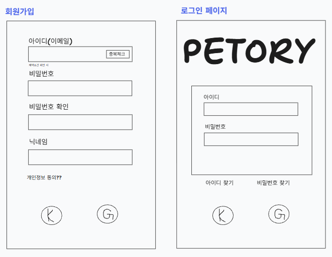

- 출력 데이터 항목 (Output Data):
  - 로고 및 헤더: 펫토리 서비스 로고 및 환영 문구
  - 로그인 입력 폼: 이메일, 비밀번호
  - 회원가입 입력 폼: 이메일, 비밀번호, 비밀번호 확인, 닉네임
  - 회원가입 추가 항목: 프로필 사진, 한 줄 소개, 주소, 개인정보 제3자 제공 동의 선택 항목
  - 제어 버튼: 로그인, 회원가입, 로그인·회원가입 화면 전환 링크
- 화면 제어 및 동작 규칙 (Behavior Rules):
  - 이메일 형식·중복 여부, 비밀번호와 확인 값의 일치 여부, 닉네임 누락 여부를 검증하고 해당 입력란 아래에 안내한다. 비밀번호 확인 값은 저장하지 않는다.
  - 프로필 사진·소개·주소는 선택 입력으로 제공하고, 사진이 없으면 기본 프로필 이미지를 표시한다.
  - 개인정보 제3자 제공 동의 시 동의 일시를 기록한다. 미동의 시 해당 값은 비워 두며 회원가입을 막지 않는 화면으로 설계한다.
  - 회원가입 완료 후 로그인 화면으로 이동하고, 로그인 성공 시 메인 피드로 이동한다.
  - 로그인 정보가 일치하지 않으면 오류를 표시하고, 이용 제한 상태(`BLOCKED`)인 계정은 서비스 이용 제한 안내를 표시한다.

### 1.2.2 비밀번호 찾기 화면 (`/findPw`)
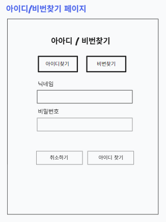

- 입력 데이터 및 검증 규칙 (Input Data & Validation):
  - 사용자 아이디(이메일): 필수 입력 항목, 공백 제출 제한
- 화면 제어 및 권한 규칙 (Behavior Rules):
  - 찾기 버튼 클릭 시 해당되는 계정 정보가 존재할 경우 패스워드 재설정하는 화면으로 이동(이메일로 링크를 보낼지는 미정), 그렇지 않다면 에러 메세지를 출력한다.
  - 취소하기 버튼 클릭시 로그인 페이지로 이동한다.

### 1.2.3 메인 피드 목록 화면 (`/main`)
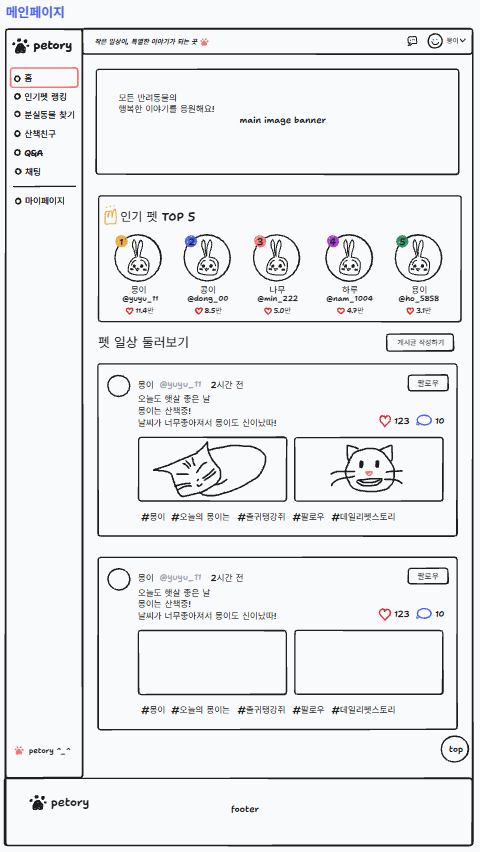

- 출력 데이터 항목 (Output Data):
  - 사이드 바 영역 : 서비스 타이틀, 인기펫 랭킹, 분실동물 찾기, 산책 친구, QnA 게시판, 1대1 채팅, 마이페이지
  - 상단 영역: 로그인한 사용자의 닉네임(비로그인시 로그인 버튼), 1대1 채팅, 서비스 타이틀 배너, 인기 펫 랭킹 사용자 이미지/닉네임/아이디/좋아요 수
  - 중앙 피드 스트림: 작성자 프로필 사진·닉네임, 작성 시간, 이미지 슬라이드, 본문, 해시태그, 배경음악 재생 버튼
  - 상호작용 요소: 좋아요 버튼, 후원하기 버튼, 북마크 버튼, 구독자 전용 표시
- 화면 제어 및 동작 규칙 (Behavior Rules):
  - 피드는 최신 작성순으로 조회하며, 하단에 도달하면 다음 목록을 불러온다. 마지막 목록까지 불러오면 추가 요청을 중단한다.
  - 해시태그 검색 시 `/main?tag={keyword}`에서 일치하는 피드를 표시한다.
  - 이미지는 저장된 순서(`sort_order`)에 따라 표시한다. 배경음악이 있는 경우에만 재생 버튼을 노출하며 사용자가 눌렀을 때 재생한다.
  - 좋아요와 북마크는 각각 선택·해제가 가능하다. 요청 실패 시 변경 전 표시로 복구하며, 두 기능을 동시에 사용할 수 있다.
  - 구독자 전용 피드는 작성자 본인 또는 해당 작성자를 유료 구독 중인 회원에게 내용을 표시한다. 그 외에는 본문·이미지·음악을 숨기고 구독 안내를 표시한다.
  - 피드 선택 시 상세 모달을 열고, 작성자 선택 시 회원 프로필로 이동한다. 비로그인 상태에서 개인 기능을 선택하면 로그인 화면으로 안내한다.
  - 검색 결과가 없거나 팔로잉 피드가 없으면 빈 목록 안내를 표시한다.

### 1.2.4 피드 상세 조회 및 댓글 모달 화면 (`/main/{postId}`)
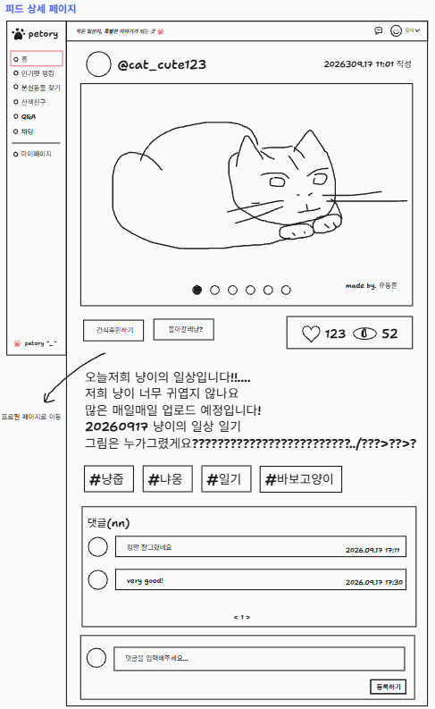

- 출력 데이터 항목 (Output Data):
  - 좌측 영역: 순서대로 넘겨 볼 수 있는 피드 이미지, 현재 이미지 위치 표시
  - 작성자 정보 영역: 작성자 프로필 사진·닉네임, 팔로우 버튼, 더보기 메뉴
  - 본문 영역: 본문 및 이미지, 해시태그, 작성/수정일시, 좋아요 수/조회수, 구독자 전용 표시
  - 댓글 영역: 입력 창, 댓글 작성자 프로필 사진·닉네임, 댓글 내용·등록 시간, 댓글 삭제 버튼
- 화면 제어 및 동작 규칙 (Behavior Rules):
  - 본인이 작성한 피드에만 수정·삭제 메뉴를 표시한다. 수정은 수정 화면으로 이동하고, 삭제는 확인 후 목록으로 돌아간다.
  - 빈 댓글은 등록하지 않는다. 댓글 등록이 완료되면 목록과 댓글 수를 갱신하고 입력창을 비운다.
  - 본인이 작성한 댓글만 삭제할 수 있으며, 삭제 전 확인창을 표시한다. 댓글은 대댓글 없이 한 단계 목록으로 구성한다.
  - 본인 피드에서는 팔로우 버튼을 숨긴다. 다른 회원의 피드에서는 현재 팔로우 여부에 따라 버튼 상태를 표시한다.
  - 구독 권한이 없으면 댓글을 포함한 상세 내용을 노출하지 않고 해당 작성자의 펫클럽 가입 화면으로 안내한다. 직접 URL로 접근한 경우에도 같은 기준을 적용한다.

### 1.2.5 신규 피드 작성 및 수정 화면 (`/posts/new`, `/posts/{postId}/edit`)
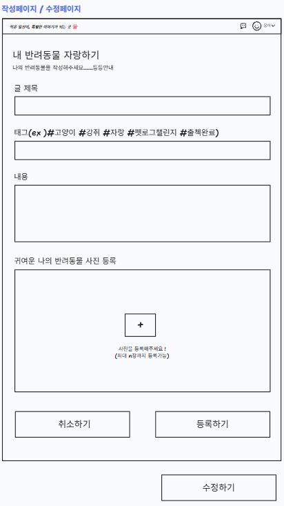

- 출력 데이터 항목 (Output Data):
  - 상단 바: 작성 취소 버튼, 게시하기 또는 수정 완료 버튼
  - 이미지 업로드 영역: 파일 선택·드래그 앤 드롭 영역, 여러 장의 이미지 미리보기, 순서 변경·제거 버튼
  - 본문 입력 영역: 피드 내용 멀티라인 입력창
  - 해시태그 입력 영역: 태그 입력창
  - 배경음악 영역: 음악 파일 선택, 선택한 음악 미리 듣기·제거 버튼
  - 공개 범위 설정: 전체 공개 또는 내 펫클럽 구독자 전용 선택
- 화면 제어 및 동작 규칙 (Behavior Rules):
  - 본문은 필수로 입력받고, 첨부 이미지·배경음악·해시태그는 선택 입력으로 제공한다. 파일 형식·용량은 업로드 정책에 따라 검증한다.
  - 이미지 선택 시 미리보기를 표시하고, 사용자가 정한 순서를 `sort_order`로 반영한다. 배경음악은 피드당 한 곡을 설정한다.
  - 해시태그는 앞의 `#`과 불필요한 공백을 정리하고, 같은 피드 안의 중복 태그는 제거한다.
  - 게시하기 클릭 시 첨부 파일 업로드를 완료한 뒤 이미지 URL·순서, 배경음악 URL, 본문, 해시태그, 공개 범위를 함께 저장한다.
  - 저장 중에는 버튼을 비활성화한다. 저장 실패 시 입력 내용을 유지하고 재시도 안내를 표시한다.
  - 수정 화면은 본인 게시글의 기존 값을 불러오며, 수정 완료 시 상세 화면으로 이동한다. 신규 등록 완료 시 메인 피드로 이동한다.
  - 작성 중 취소하거나 화면을 떠나는 경우 입력 내용이 사라질 수 있음을 확인한다.

### 1.2.6 마이페이지·회원 프로필 및 북마크 화면 (`/profile/{memberId}`)
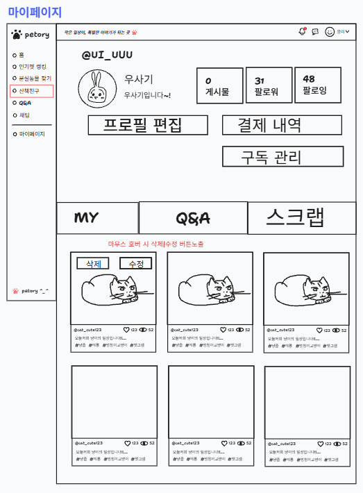

- 출력 데이터 항목 (Output Data):
  - 프로필 헤더: 프로필 정보(사진/닉네임/아이디/소개글), 게시글/팔로워/팔로잉 수
  - 내 프로필 제어 버튼: 프로필 수정, 구독 관리, 결제 내역
  - 다른 회원 프로필 제어 버튼: 팔로우·팔로우 취소, 메시지 보내기, 간식 쏘기, 펫클럽 가입 또는 구독 중 표시
  - 탭 메뉴:  피드/QnA 게시글 목록,  내 프로필에서만 보이는 북마크 보관함
  - 프로필 수정 영역: 프로필 사진, 닉네임, 한 줄 소개, 주소, 읽기 전용 이메일
- 화면 제어 및 동작 규칙 (Behavior Rules):
  - 게시글·팔로워·팔로잉 수는 해당 회원의 실제 데이터로 집계한다. 팔로워·팔로잉 수를 누르면 각각의 목록으로 이동한다.
  - 이메일과 주소는 본인의 설정 영역에만 표시하며 공개 프로필에는 표시하지 않는다.
  - 프로필 수정은 본인만 가능하며, 저장 완료 후 변경 내용을 헤더에 반영한다.
  - 후원/구독 버튼 클릭 시 유효성 검증 후 후원/구독하기 화면으로 이동한다.
  - 구독 버튼 클릭 시 유효성 검증 후 구독하기 화면으로 이동한다.
  - 팔로우 버튼 클릭 시 유효성 검증 후 사용자의 팔로잉으로 상대방을 추가하고 상대방의 팔로워로 사용자를 추가한다.
  - My/QnA 버튼 클릭 시 사용자가 작성한 피드/QnA 게시글 목록을 보여준다.
  - 북마크 보관함은 본인만 조회할 수 있다. 삭제된 피드는 제외하고, 구독 권한이 사라진 피드는 잠금 상태로 표시한다.
  - 메시지 보내기를 누르면 상대방과의 1:1 채팅방으로 이동한다. 후원·구독 버튼은 선택한 회원을 대상으로 결제 화면을 연다.
  - 본인 프로필에서는 자신을 팔로우하거나 후원·구독하는 버튼을 표시하지 않는다.

### 1.2.7 간식 후원·펫클럽 구독 및 결제 관리 화면 (`/donate/{memberId}`, `/membership/{memberId}`, `/payments/{memberId}`)
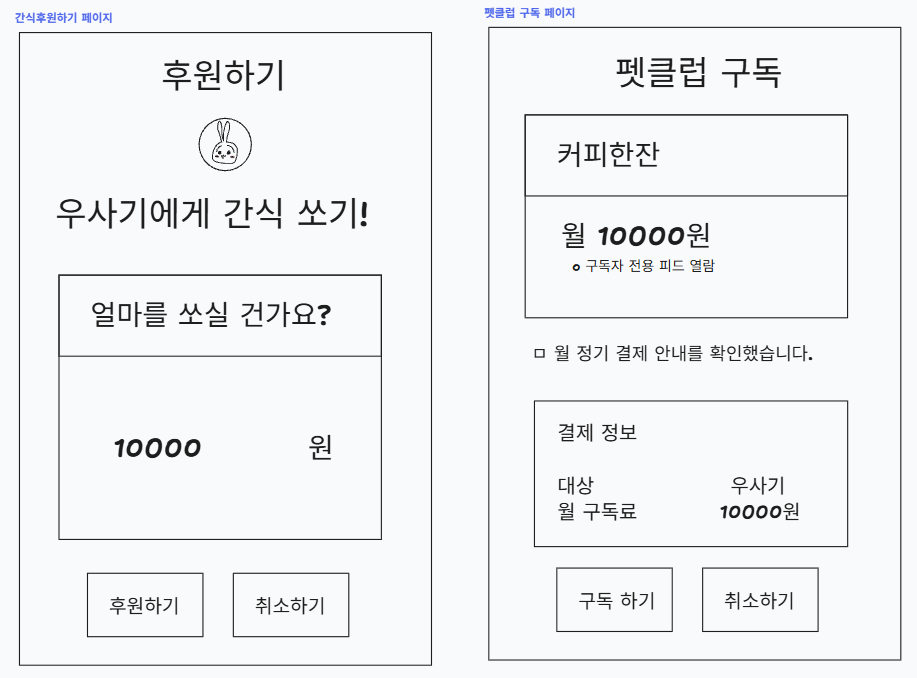
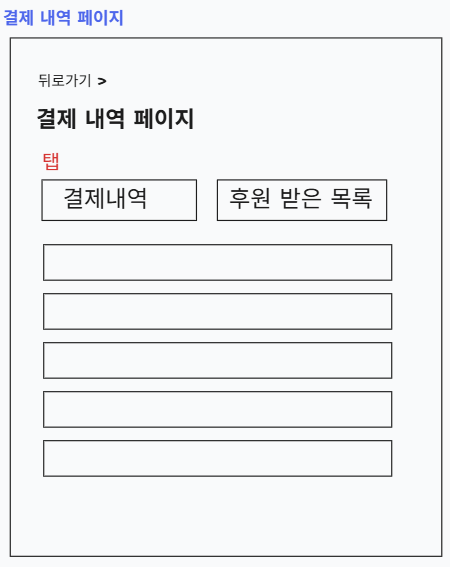

- 출력 데이터 항목 (Output Data):
  - 후원 대상 영역: 대상 회원의 프로필 사진·닉네임, 후원·구독하기 선택 탭
  - 후원하기 영역: 1회 후원 금액 선택·입력, 결제 수단 선택, 최종 결제 금액, 결제 버튼
  - 구독하기 영역: 대상 회원, 플랜 이름, 월 구독료, 해당 회원의 구독자 전용 피드 이용 안내, 정기 결제 안내
  - 내 구독 목록: 구독 대상, 플랜 이름, 월 결제 금액, 구독 상태, 누적 구독 개월 수, 시작일, 다음 결제 예정일, 해지 완료일 - 마이페이지로 이동
  - 결제 내역: 후원·구독 유형, 상대 회원, 금액, 결제 수단, 결제 요청 일시, 결제 상태, 주문번호 - 마이페이지
  - 제어 버튼: 결제하기, 구독 일시정지·재개·해지, 보낸 후원·받은 후원 내역 전환
- 화면 제어 및 동작 규칙 (Behavior Rules):
  - 간식 쏘기는 1회 결제로, 펫클럽 가입은 선택한 회원에 대한 정기 결제로 처리한다. 금액은 양수 정수로 검증하고 실제 결제 금액은 서버에서 확인한다.
  - 결제창을 열기 전 주문을 생성하고, 결제창 결과를 받은 뒤 서버에서 주문·금액·대상·승인 결과를 검증한다. 검증 완료 후 결제 성공을 표시한다.
  - 결제 상태는 `READY`(결제 대기), `PAID`(결제 완료), `FAILED`(실패), `CANCELLED`(취소)로 구분한다. 실패·취소 시 구독 권한을 부여하지 않는다.
  - 구독은 `ACTIVE`(이용 중), (`PAUSED`(일시정지),) `CANCELLED`(해지)로 표시한다. 동일 대상의 활성 구독이 있으면 중복 가입 대신 구독 관리로 안내한다.
  - 구독자 전용 피드 이용 권한은 대상 회원과 활성 구독 여부로 판단한다. 서비스 전체 회원 등급이나 다른 회원의 전용 피드 권한은 변경하지 않는다.
  - 일시정지·해지 확인창에 권한 종료 시점과 다음 결제 중단 여부를 안내한다.
  - 해지 완료 구독에는 해지일을 표시하고 다음 결제일은 표시하지 않는다.
  - 결제·구독 목록은 본인과 관련된 내역만 조회한다. 받은 후원은 결제 내역이며, 정산 완료나 출금 가능 금액으로 표시하지 않는다. - 보류
  - 카드번호·카드사 표시 정보가 ERD에 없으므로 등록 카드 상세 영역은 두지 않는다. 결제 인증은 결제창에서 진행한다. - 보류

### 1.2.8 팔로워 및 팔로잉 목록 화면 (`/{memberId}/followers`, `/{memberId}/following`)
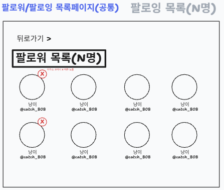

- 출력 데이터 항목 (Output Data):
  - 상단 영역: 조회 대상 회원의 닉네임, 팔로워·팔로잉 탭, 각 목록의 인원수
  - 회원 목록: 프로필 사진, 닉네임, (한 줄 소개), 로그인한 회원 기준 팔로우 여부
  - 제어 버튼: 팔로우, 팔로잉 또는 팔로우 취소 - 보류
- 화면 제어 및 동작 규칙 (Behavior Rules):
  - 팔로워는 조회 대상을 팔로우하는 회원, 팔로잉은 조회 대상이 팔로우하는 회원을 표시한다.
  - 회원 프로필을 선택하면 해당 회원 화면으로 이동한다. 목록이 비어 있으면 안내 문구를 표시한다.

### 1.2.9 알림 화면 (`/notifications`)
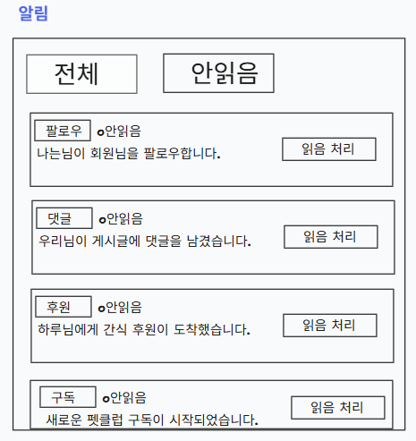

- 출력 데이터 항목 (Output Data):
  - 알림 목록: 알림 유형, 알림 내용, 발생 시간, 읽음·안읽음 표시
  - 알림 필터: 전체, 안읽음
  - 제어 버튼: 알림 읽음 처리 버튼
- 화면 제어 및 동작 규칙 (Behavior Rules):
  - 로그인한 회원에게 전달된 알림만 최신순으로 조회한다. 팔로우·댓글·후원·구독·반려동물 생일 등 저장된 유형에 맞춰 표시한다.
  - 알림 확인 시 `is_checked`를 읽음으로 변경하고 안읽음 수를 갱신한다.

### 1.2.10 1:1 채팅 목록 및 대화 화면 (`/chat`, `/chat/{roomId}`)
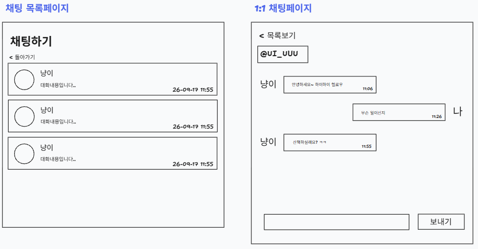

- 출력 데이터 항목 (Output Data):
  - 좌측 채팅방 목록: 상대 회원의 프로필 사진·닉네임, 마지막 메시지, 마지막 메시지 시간
  - 대화 상단 영역: 상대 회원 정보, 프로필 이동 버튼, 채팅방 나가기 메뉴
  - 대화 영역: 발신자별로 구분된 메시지 말풍선, 전송 시간, 날짜 구분선
  - 하단 입력 영역: 텍스트 입력창, 전송 버튼
- 화면 제어 및 동작 규칙 (Behavior Rules):
  - 본인이 참여한 채팅방만 조회한다. 상대 프로필에서 대화를 시작하면 두 회원의 기존 방을 확인해 사용하고, 없으면 방을 생성한다.
  - 채팅방 목록은 마지막 메시지 시간순으로 정렬하고, 대화는 전송 시간순으로 표시한다. 이전 메시지는 위로 스크롤할 때 추가 조회한다.
  - 빈 메시지는 전송하지 않는다. 전송 성공한 메시지를 대화 목록에 반영하며, 실패 시 입력 내용을 유지하고 재시도할 수 있게 한다.
  - 열린 채팅방은 새 메시지를 수신하면 목록을 갱신한다. 실시간 수신 방식은 별도 구현 시 결정한다.
  - 나가기 확인 후 해당 참여자의 나가기 상태를 변경하고 본인의 방 목록에서 숨긴다. 상대방의 메시지 이력은 삭제하지 않는다.
  - 같은 상대와 다시 대화를 시작하면 기존 방의 본인 나가기 상태를 해제하고 저장된 대화 이력을 표시하는 방식으로 설계한다.
  - 참여자가 아닌 회원은 직접 URL로 접근해도 대화를 볼 수 없다. 읽음 여부·미확인 메시지 수·사진 첨부는 현재 채팅 메시지 컬럼에 없어 포함하지 않는다.

### 1.2.11 인기펫 랭킹 화면 (`/ranking`)
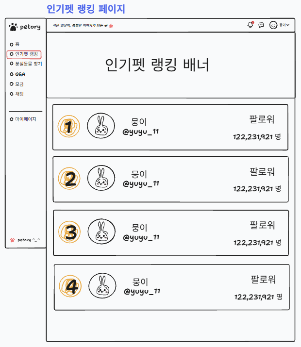

- 출력 데이터 항목 (Output Data): 랭킹에 등재된 사용자의 닉네임/아이디/팔로워 수
- 화면 제어 및 권한 규칙 (Behavior Rules):
  - 랭킹의 사용자 프로필 클릭시 해당 사용자의 프로필 페이지로 이동
  - 사이드 바 및 상단영역 요소 클릭시 요소에 해당하는 게시판으로 이동

### 1.2.12 실종 반려동물 목록 및 상세 화면 (`/missing-pets`, `/missing-pets/{missingPetPostId}`)
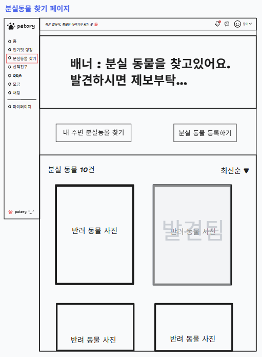
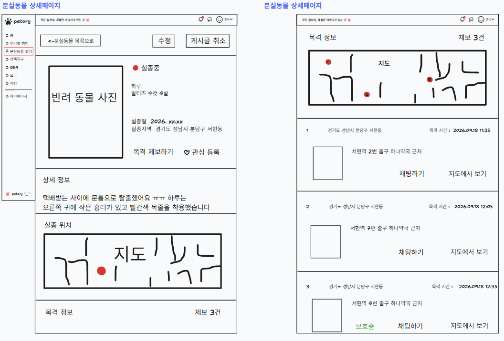

- 출력 데이터 항목 (Output Data):
  - 목록 상단 영역: 실종 장소·동물 종 검색 조건, 실종 신고 작성 버튼, 목록·지도 전환
  - 실종 카드 목록: 대표 사진, 동물 이름·종·성별·나이, 실종일자, 실종 장소, 작성 시간
  - 지도 영역: 좌표가 등록된 실종 장소 마커, 선택한 신고의 요약 카드
  - 상세 영역: 대표 사진, 동물 기본 정보, 실종일자·장소, 특이사항, 작성자 프로필·닉네임, 작성일시·수정일시
  - 목격 제보 목록: 제보자, 목격 장소·일시, 상황 설명, 제보 사진, 제보 상태, 등록일시
  - 제어 버튼: 목격 제보하기, 작성자에게 메시지 보내기, 본인 신고 수정·삭제, 본인 제보 수정·삭제
- 화면 제어 및 동작 규칙 (Behavior Rules):
  - 실종 신고는 최신 작성순으로 표시하며 장소·종 조건으로 필터링한다. 사진이 없으면 기본 이미지를 표시한다.
  - 지도는 위도·경도가 있는 신고만 마커로 표시한다. 좌표가 없는 신고도 목록에서는 조회할 수 있다.
  - 신고 카드를 선택하면 상세 화면에서 해당 신고에 연결된 목격 제보를 함께 조회한다. 제보 장소도 좌표가 있을 때 지도에 표시한다.
  - 목격 제보하기를 누르면 현재 신고에 대한 제보 작성 화면으로 이동한다. 작성자에게 메시지 보내기는 1:1 채팅으로 연결한다.
  - 본인의 신고·제보에만 수정·삭제 버튼을 표시한다. 신고 삭제 시 연결된 제보도 삭제됨을 확인창에서 안내한다.
  - `MISSING`·`FOUND`·`CANCELLED`는 상세 표상의 상태이므로 각 분실동물 게시글에 표시한다. 신고 자체에는 상태 컬럼이 없어 전체 사건의 찾기 완료 버튼이나 완료 배지는 두지 않는다.
  - 제보가 없으면 첫 제보 안내를 표시하며, 회원의 비공개 주소·이메일은 상세 화면에 표시하지 않는다.

### 1.2.13 실종 신고 및 목격 제보 작성·수정 화면 (`/missing-pets/new`, `/missing-pets/{missingPetPostId}/edit`, `/missing-pets/{missingPetPostId}/reports/new`, `/missing-pets/{missingPetPostId}/reports/{reportId}/edit`)
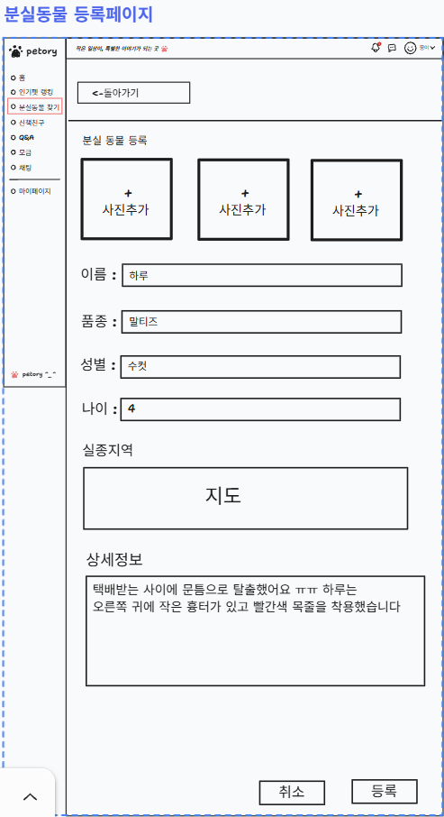
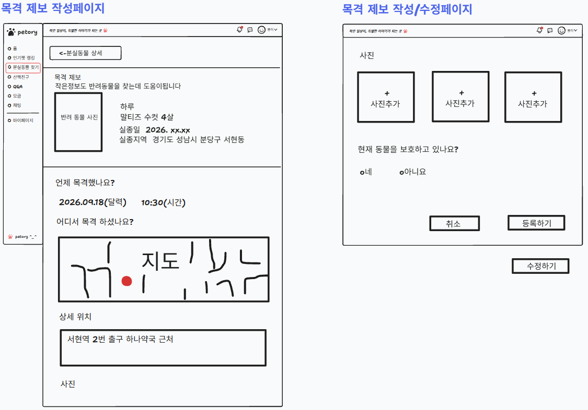

- 출력 데이터 항목 (Output Data):
  - 실종 신고 입력 폼: 동물 이름, 종, 성별, 나이, 실종일자, 실종 장소, 특이사항, 대표 사진 한 장
  - 신고 입력 보조: 내 반려동물 정보 자동 불러오기, 실종 장소 검색·지도 위치 선택
  - 목격 제보 입력 폼: 대상 실종 동물 요약, 목격 장소, 실제 목격 일시, 상황 설명, 사진 한 장, 제보 상태
  - 위치 미리보기: 선택한 주소와 지도 마커
  - 제어 버튼: 사진 선택·변경·제거, 등록 또는 수정 완료, 취소
- 화면 제어 및 동작 규칙 (Behavior Rules):
  - 실종 신고는 동물 이름·종·실종일자·실종 장소를 필수로 입력받는다. 성별·나이·특이사항·대표 사진은 선택 입력으로 제공한다.
  - 내 반려동물을 선택하면 기본 정보를 입력란에 복사한다. 신고에는 별도 동물 정보가 저장되므로 이후 반려동물 프로필 변경이 기존 신고 내용을 자동으로 바꾸지 않는다.
  - 목격 제보는 현재 신고 ID를 유지하며, 목격 장소·실제 목격 일시·상태를 필수로 입력받는다. 상황 설명과 사진은 선택 입력으로 제공한다.
  - 장소를 검색하거나 지도에서 위치를 선택하면 주소와 좌표를 함께 설정한다. 주소만 입력한 경우 좌표 없이 저장할 수 있다.
  - 실종일자와 목격 일시는 미래 값을 입력할 수 없다. 사진 업로드가 완료된 뒤 해당 URL과 입력 내용을 저장한다.
  - 수정 화면은 기존 내용을 불러오고 작성자만 저장할 수 있다. 작성일시는 유지하며 수정일시를 갱신한다.
  - 등록·수정 완료 후 해당 실종 신고 상세 화면으로 돌아가 변경 내용을 표시한다. 저장 실패 시 입력 내용을 유지한다.

### 1.2.14 QnA 페이지 목록/상세 화면 (`/qna` , `/qna/{qnaId}` )
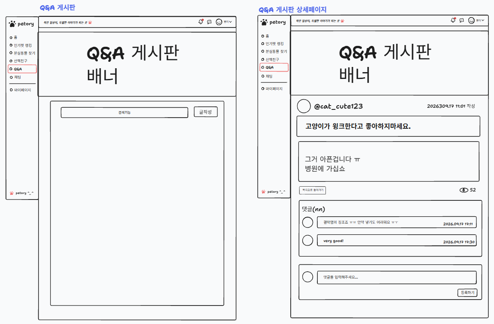

- 출력 데이터 항목 (Output Data):
  - 목록 영역: QnA 게시판 배너, 검색 바, QnA 게시글 목록, 조회순/최신순 필터
  - 상세 영역: 이미지, 작성자 프로필 이미지/아이디, 작성일시, 좋아요 수/조회수, 후원하기 버튼, 게시글 본문, 태그
  - 댓글 영역: 댓글 작성자 프로필 이미지/아이디, 작성일시, 댓글 내용 목록 및 댓글 작성 폼, 댓글 목록 페이지네이션
- 화면 제어 및 권한 규칙 (Behavior Rules):
  - 글 작성하기 버튼 클릭 시 QnA 작성 화면으로 이동한다.
  - 검색바에서 키워드 검색 시 키워드에 해당하는 게시물들 출력한다.
  - 게시글 작성자 본인 인증 시에만 수정 및 삭제 버튼 노출한다.
  - 작성자 프로필 클릭시 작성자 페이지로 이동한다.
  - 댓글 작성자 본인인 경우 댓글 수정 및 삭제 버튼 노출한다.
  - 비로그인
    - 글 작성하기, 후원하기 및 댓글 작성 접근 시 HttpSession 검증 후 로그인 페이지 이동

### 1.2.15 QnA 작성/수정 화면 (POST `/qna/write`, `/qna/edit`)
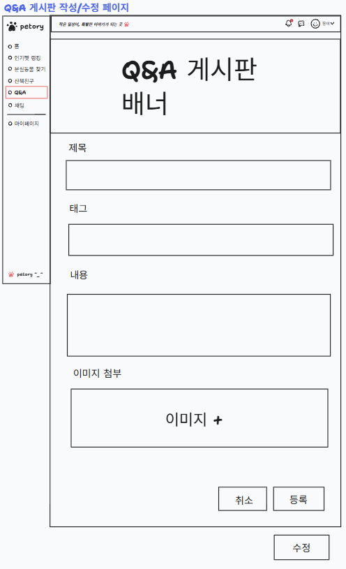

- 입력 데이터 및 검증 규칙 (Input Data & Validation):
  - 제목: 필수 입력 항목, 공백 제출 제한, 최대 50자 이하
  - 태그: 공백 제출 가능, 최대 50자 이하
  - 본문: 필수 입력 항목, 공백 제출 제한, 최대 1000자 이하
  - 이미지: 필수 첨부 항목, 이미지 최대 5장 제한
- 출력 데이터 항목 (Output Data):
  - 본문 영역: QnA 수정 시 사용자가 첨부한 이미지와 작성한 QnA의 내용 및 태그
- 화면 제어 및 권한 규칙 (Behavior Rules):
  - 취소 버튼 클릭 시 QnA 페이지로 이동한다.
  - 등록 버튼 클릭 시 유효성 검증 후 QnA 등록 처리한다.
  - 수정 버튼 클릭 시 유효성 검증 후 QnA 수정 처리한다.
    - 글 본문만 수정 시 기존 이미지 유지
    - 이미지만 수정 시 기존 작성 글 유지, 기존 이미지 삭제 후 새 이미지 등록

---

## 1.3 전체 화면 와이어프레임 배치도
